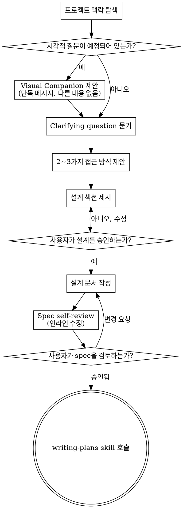

# 아이디어를 설계로 발전시키는 Brainstorming

자연스러운 협업 대화를 통해 아이디어를 완전한 설계와 spec으로 발전시키도록 돕습니다.

먼저 현재 프로젝트의 맥락을 파악한 다음, 한 번에 하나씩 질문하여 아이디어를 다듬으세요. 무엇을 만들지 이해했다면 설계를 제시하고 사용자의 승인을 받으세요.

<HARD-GATE>
설계를 제시하고 사용자가 승인하기 전에는 어떤 구현 skill도 호출하거나, 어떤 코드도 작성하거나, 어떤 프로젝트도 scaffolding하거나, 어떤 구현 행위도 하지 마세요. 이는 단순해 보이는지와 무관하게 모든 프로젝트에 적용됩니다.
</HARD-GATE>

## 안티패턴: "이건 너무 간단해서 설계가 필요 없다"

모든 프로젝트는 이 과정을 거칩니다. 할 일 목록, 단일 함수 유틸리티, 설정 변경 — 전부 마찬가지입니다. "간단한" 프로젝트야말로 검증되지 않은 가정 때문에 가장 많은 작업이 낭비되는 곳입니다. 설계는 짧을 수 있습니다(정말 간단한 프로젝트라면 몇 문장으로). 하지만 반드시 제시하고 승인을 받아야 합니다.

## Checklist

다음 각 항목에 대한 task를 생성하고 순서대로 완료해야 합니다:

1. **프로젝트 맥락 탐색** — 파일, 문서, 최근 commit 확인
2. **Visual Companion 제안** (주제가 시각적 질문을 포함할 경우) — 이 메시지는 단독으로 보내며, clarifying question과 결합하지 않습니다. 아래 Visual Companion 섹션 참조.
3. **Clarifying questions 묻기** — 한 번에 하나씩, 목적/제약/성공 기준을 이해
4. **2~3가지 접근 방식 제안** — 트레이드오프와 추천안 함께 제시
5. **설계 제시** — 복잡도에 맞춰 섹션별로 나누고, 각 섹션 후 사용자 승인 받기
6. **설계 문서 작성** — `docs/suberpowers/specs/YYYY-MM-DD-<topic>-design.md`에 저장하고 commit
7. **Spec self-review** — 자리표시자, 모순, 모호함, 범위에 대한 빠른 인라인 점검(아래 참조)
8. **사용자가 작성된 spec 검토** — 진행 전에 사용자가 spec 파일을 검토하도록 요청
9. **구현 단계로 전환** — writing-plans skill을 호출하여 implementation plan 생성

## Process Flow

**최종 상태는 writing-plans 호출입니다.** frontend-design, mcp-builder, 또는 다른 어떤 구현 skill도 호출하지 마세요. brainstorming 이후 호출하는 유일한 skill은 writing-plans입니다.

## 진행 방식

**아이디어 이해하기:**

- 먼저 현재 프로젝트 상태를 확인하세요(파일, 문서, 최근 commit)
- 세부 질문 전에 범위를 평가하세요: 요청이 여러 독립적인 서브시스템을 묘사한다면(예: "채팅, 파일 저장소, 결제, 분석이 포함된 플랫폼 구축"), 즉시 이를 지적하세요. 먼저 분해되어야 할 프로젝트의 세부사항을 다듬는 데 질문을 쓰지 마세요.
- 프로젝트가 단일 spec으로 다루기에 너무 크다면, 사용자가 서브 프로젝트로 분해하도록 도우세요: 독립적인 단위는 무엇이며, 어떻게 관련되고, 어떤 순서로 구축해야 하는가? 그런 다음 첫 번째 서브 프로젝트를 일반 설계 흐름으로 brainstorming하세요. 각 서브 프로젝트는 자체적인 spec → plan → implementation cycle을 가집니다.
- 적절한 범위의 프로젝트에 대해서는 한 번에 하나씩 질문하여 아이디어를 다듬으세요
- 가능하면 객관식 질문을 선호하되, 개방형 질문도 괜찮습니다
- 메시지당 하나의 질문만 — 주제가 더 많은 탐색이 필요하다면 여러 질문으로 나누세요
- 목적, 제약, 성공 기준을 이해하는 데 초점을 맞추세요

**접근 방식 탐색:**

- 트레이드오프와 함께 2~3가지 다른 접근 방식을 제안하세요
- 추천안과 그 이유를 포함해 대화형으로 옵션을 제시하세요
- 추천 옵션을 먼저 제시하고 이유를 설명하세요

**설계 제시:**

- 무엇을 만들지 이해했다고 판단되면 설계를 제시하세요
- 각 섹션을 복잡도에 맞춰 조정하세요: 간단하면 몇 문장, 섬세한 부분은 200~300단어까지
- 각 섹션 후에 지금까지 맞는지 물어보세요
- 다루어야 할 항목: 아키텍처, 컴포넌트, 데이터 흐름, 에러 처리, 테스트
- 무언가 말이 안 된다면 되돌아가 명확히 할 준비를 하세요

**격리와 명확성을 위한 설계:**

- 시스템을 각각 하나의 명확한 목적을 가지고, 잘 정의된 인터페이스로 소통하며, 독립적으로 이해되고 테스트될 수 있는 더 작은 단위로 나누세요
- 각 단위에 대해 답할 수 있어야 합니다: 무엇을 하는가, 어떻게 사용하는가, 무엇에 의존하는가?
- 누군가가 내부를 읽지 않고도 단위가 무엇을 하는지 이해할 수 있는가? 소비자를 깨뜨리지 않고 내부를 변경할 수 있는가? 그렇지 않다면 경계를 다듬어야 합니다.
- 더 작고 잘 경계가 정해진 단위는 당신이 작업하기에도 더 쉽습니다 — 한 번에 context에 담을 수 있는 코드를 더 잘 추론하며, 파일이 집중되어 있을 때 편집이 더 안정적입니다. 파일이 커진다는 것은 종종 너무 많은 일을 하고 있다는 신호입니다.

**기존 코드베이스에서 작업하기:**

- 변경을 제안하기 전에 현재 구조를 탐색하세요. 기존 패턴을 따르세요.
- 기존 코드가 작업에 영향을 미치는 문제(예: 너무 커진 파일, 불명확한 경계, 얽힌 책임)를 가지고 있다면, 좋은 개발자가 작업 중인 코드를 개선하듯이 표적화된 개선을 설계에 포함하세요.
- 관련 없는 refactoring을 제안하지 마세요. 현재 목표에 기여하는 것에 집중하세요.

## 설계 이후

**문서화:**

- 검증된 설계(spec)를 `docs/suberpowers/specs/YYYY-MM-DD-<topic>-design.md`에 작성하세요
  - (spec 위치에 대한 사용자 선호도가 이 기본값을 재정의합니다)
- 사용 가능하다면 elements-of-style:writing-clearly-and-concisely skill을 사용하세요
- 설계 문서를 git에 commit하세요

**Spec Self-Review:**
spec 문서를 작성한 후, 새로운 눈으로 살펴보세요:

1. **자리표시자 스캔:** "TBD", "TODO", 미완성 섹션, 또는 모호한 요구사항이 있는가? 수정하세요.
2. **내부 일관성:** 섹션 간에 서로 모순되는 부분이 있는가? 아키텍처가 기능 설명과 일치하는가?
3. **범위 점검:** 단일 implementation plan을 위해 충분히 집중되어 있는가, 아니면 분해가 필요한가?
4. **모호성 점검:** 어떤 요구사항이라도 두 가지 다른 방식으로 해석될 수 있는가? 그렇다면 하나를 골라 명시적으로 만드세요.

문제는 인라인으로 수정하세요. 재검토할 필요 없이 — 수정하고 진행하세요.

**User Review Gate:**
spec review 루프가 통과한 후, 진행 전에 사용자에게 작성된 spec을 검토하도록 요청하세요:

> "Spec을 작성하여 `<path>`에 commit했습니다. 검토해 보시고, implementation plan 작성을 시작하기 전에 변경하고 싶은 부분이 있으면 알려주세요."

사용자의 응답을 기다리세요. 변경을 요청하면 반영하고 spec review 루프를 다시 실행하세요. 사용자가 승인한 후에만 진행하세요.

**구현:**

- writing-plans skill을 호출하여 상세한 implementation plan을 생성하세요
- 다른 어떤 skill도 호출하지 마세요. writing-plans가 다음 단계입니다.

## 핵심 원칙

- **한 번에 하나의 질문** - 여러 질문으로 압도하지 마세요
- **객관식 선호** - 가능하면 개방형보다 답하기 쉽습니다
- **YAGNI 철저히** - 모든 설계에서 불필요한 기능을 제거하세요
- **대안 탐색** - 결정 전에 항상 2~3가지 접근 방식을 제안하세요
- **점진적 검증** - 설계를 제시하고, 다음으로 넘어가기 전에 승인을 받으세요
- **유연하게** - 무언가 말이 안 되면 되돌아가 명확히 하세요

## Visual Companion

brainstorming 중에 mockup, 다이어그램, 시각적 옵션을 보여주기 위한 브라우저 기반 동반자입니다. 모드가 아닌 — 도구로 제공됩니다. companion을 수락한다는 것은 시각적 처리가 도움이 되는 질문에 사용할 수 있다는 의미이며, 모든 질문이 브라우저를 거친다는 뜻은 아닙니다.

**Companion 제안하기:** 앞으로의 질문이 시각적 콘텐츠(mockup, 레이아웃, 다이어그램)를 포함할 것으로 예상되면, 한 번 동의를 구하기 위해 제안하세요:
> "지금 다루는 내용 중 일부는 웹 브라우저로 보여드리면 설명하기 더 쉬울 것 같습니다. 진행하면서 mockup, 다이어그램, 비교 자료 같은 시각 자료를 만들어 드릴 수 있어요. 이 기능은 아직 새로운 기능이고 token을 많이 사용할 수 있습니다. 한번 시도해 볼까요? (로컬 URL을 여는 작업이 필요합니다)"

**이 제안은 반드시 단독 메시지여야 합니다.** clarifying question, 맥락 요약, 다른 어떤 콘텐츠와도 결합하지 마세요. 메시지는 위의 제안만 포함하고 그 외에는 아무것도 포함해서는 안 됩니다. 계속하기 전에 사용자의 응답을 기다리세요. 거절하면 텍스트 전용 brainstorming으로 진행하세요.

**질문별 결정:** 사용자가 수락한 후에도, **각 질문마다** 브라우저를 사용할지 터미널을 사용할지 결정하세요. 기준: **사용자가 읽는 것보다 보는 것이 더 잘 이해될까?**

- 시각적인 콘텐츠에는 **브라우저 사용** — mockup, 와이어프레임, 레이아웃 비교, 아키텍처 다이어그램, 나란히 놓인 시각적 디자인
- 텍스트 콘텐츠에는 **터미널 사용** — 요구사항 질문, 개념적 선택, 트레이드오프 목록, A/B/C/D 텍스트 옵션, 범위 결정

UI 주제에 대한 질문이 자동으로 시각적 질문이 되는 것은 아닙니다. "이 맥락에서 personality는 무엇을 의미하나요?"는 개념적 질문 — 터미널을 사용하세요. "어느 마법사 레이아웃이 더 잘 작동하나요?"는 시각적 질문 — 브라우저를 사용하세요.

companion에 동의하면, 진행 전에 상세 가이드를 읽으세요:
`skills/brainstorming/visual-companion.md`
