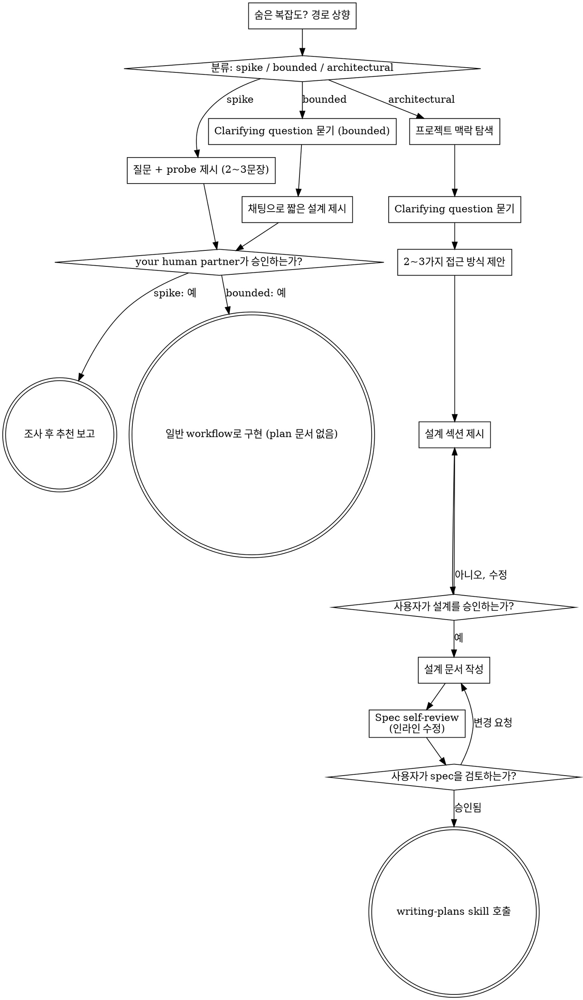

# 아이디어를 설계로 발전시키는 Brainstorming

자연스러운 협업 대화를 통해 아이디어를 완전한 설계와 spec으로 발전시키도록 돕습니다.

먼저 요청에 프로세스가 얼마나 필요한지 분류한 다음, 선택한 경로를 따라 진행하세요: 맥락을 이해하고, 아이디어를 다듬고, 설계를 제시하고, your human partner의 승인을 받으세요.

## 공유된 이해 확립

brainstorming의 결과물은 your human partner가 알아보고 바로잡을 수 있는 이해이며, 그 이해는 your human partner가 이루고자 하는 것에 근거해야 합니다.

1. **의도 파악.** 요청과 사용 가능한 맥락을 바탕으로 의도한 결과, 누구를 위한 것인지, 무엇을 성공으로 볼지 파악하세요. 이 정보가 없다면, 기능이나 접근 방식을 제안하기 전에 목적이나 의도한 용도에 대해 핵심을 짚는 질문 하나를 하세요. 앱의 장르를 안다고 해서 your human partner가 왜 그것을 원하는지 알게 되는 것은 아닙니다. 빠진 요구사항을 모으는 것은 작업을 다시 승인해 달라고 요청하는 것이 아닙니다.
2. **이해한 내용을 글로 돌려주기.** 의도한 결과, 관련 제약, 성공 기준을 your human partner가 평가할 수 있는 짧은 메모로 요약하세요. your human partner가 말한 것과 가정을 구분하세요. 바로잡을 부분이 있는지 물어보고, 답을 받으면 반영한 뒤에 이 메모를 설계 개요로 삼으세요.
3. **의도를 설계로 이어가기.** 합의된 이해를 선택한 경로의 설계 산출물에 보존하세요: architectural 작업은 작성된 spec, bounded 작업과 spike는 채팅 내 설계/probe입니다. 제안하는 기능과 기술적 선택을 그 이해에 비추어 점검하세요.

요청에 이미 목적과 제약이 담겨 있다면, 같은 질문을 다시 하지 말고 그 이해를 정리해 돌려주세요. 메모는 간결하게 유지하세요. 중요한 것은 메모의 정확성과 바로잡을 기회입니다.

<HARD-GATE>
구현 skill 호출, 제품 코드 작성, scaffolding, 제품 의존성 설치, 외부 프로젝트 생성을 포함한 어떤 구현 행위든 하기 전에, 선택한 경로의 선행 조건을 완료하세요:

- Spike: your human partner가 질문과 probe를 승인합니다.
- Bounded: your human partner가 채팅 내 짧은 설계를 승인합니다.
- Architectural: your human partner가 작성된 spec을 검토하고 승인한 다음, 작성된 implementation plan을 검토하고 실행 방식을 선택합니다. 대화 중 설계 승인은 spec 작성만 허용합니다. 작성된 spec의 승인은 writing-plans 호출만 허용합니다.

답변은 실제로 제시된 단계만 승인합니다. 아이디어나 기능 범위에 대한 승인은 아직 존재하지 않는 산출물까지 승인하지 않습니다. 완료되지 않은 가장 이른 단계에서 재개하세요. 한 번의 승인을 선택한 경로의 나머지 단계를 건너뛰는 허가로 바꾸지 마세요. 선행 조건이 완료되지 않은 동안에도 읽기 전용 프로젝트 탐색은 허용됩니다.
</HARD-GATE>

## 세 가지 경로

첫 질문 전에 요청을 분류하고, your human partner가 뒤집을 수 있도록 그 분류를 명시적으로 말하세요 — "bounded로 보이니 spec을 작성하지 않고 여기서 짧은 설계를 제시하겠습니다":

- **Spike** — 실현 가능성을 묻는 질문입니다("~할 수 있을까", "~가 가능한가", "대충 해도 괜찮아"). 결과물은 유지할 코드가 아니라 답입니다. 질문과 무엇을 시도할지를 2~3문장으로 제시하고, 동의를 받은 다음, 정확성이 허용하는 한 가장 적은 비용으로 알아내세요. 설계 문서도, spec 파일도 없습니다. 발견한 내용은 추천으로 보고하세요. 만든 것은 무엇이든 버릴 코드로 표시하세요.
- **Bounded** — 이 repo에 이미 존재하는 코드에 대한 범위가 명확한 변경입니다: 새 flag, 작은 endpoint, 파일 하나짜리 수정. 어떤 종류의 앱인지 이해하는 것만으로는 부족합니다 — bounded란 변경하려는 흐름이 이미 이 repo에 있어 읽을 수 있다는 뜻입니다. 변경할 기존 흐름이 없다면 그 작업은 bounded가 아닙니다. 중요한 clarifying question을 묻고, 짧은 설계를 **채팅으로** 제시한 뒤(몇 문장에서 짧은 몇 문단), STOP - 멈추세요. 구현은 your human partner가 그 설계에 yes라고 답한 뒤에만 시작합니다 — bounded 작업의 승인은 architectural 작업의 승인만큼 엄격한 관문입니다. spec 파일도, implementation plan 문서도 없습니다.
- **Architectural** — 새 프로젝트, 새 서브시스템, 컴포넌트가 맞물리는 방식을 재구성하거나 다른 쪽이 의존하는 인터페이스를 바꾸는 변경입니다. 전체 프로세스를 따르세요: 질문, 접근 방식, 섹션별 설계, 작성된 spec, 그다음 writing-plans skill.

두 경로 사이에서 망설여지면 더 무거운 쪽을 택하세요. 경로 변경은 한 방향으로만 일어납니다: 작업 도중 발견한 숨은 복잡도는 경로를 상향합니다 — 멈추고, 그렇다고 말하고, 한 단계 올리세요. 작업 도중 경로가 하향되는 일은 없습니다.

## 안티패턴: "너무 간단해서 승인이 필요 없다"

모든 경로는 구현 전에 your human partner가 필요한 설계를 승인하는 것으로 끝납니다. bounded 변경은 채팅 두 문장이면 충분할 수도 있습니다. 새 할 일 목록 프로젝트는 architectural이며 작성된 spec과 planning handoff가 필요합니다. 산출물의 규모는 선택한 경로에 맞추고, 구현 전에 그 경로의 review를 완료하세요.

## 위험 신호

| 생각 | 실제 |
|---------|---------|
| "이건 너무 간단해서 설계가 필요 없다" | 선택한 경로를 따르세요: bounded 변경은 채팅으로 짧은 설계를, architectural 변경은 작성된 spec과 planning handoff를 거칩니다. |
| "bounded라고 하고 spec은 건너뛰자" | 작업을 건너뛰려고 분류 이름을 찾는 것 **자체가** 망설임입니다 — 더 무거운 경로를 택하세요. |
| "bounded이고 설계가 뻔하니 your human partner가 읽는 동안 시작하자" | 관문은 설계의 길이가 아니라 승인입니다. 제시한 다음, yes를 들을 때까지 멈추세요. |
| "이런 종류의 앱은 잘 아니까 bounded다" | bounded는 당신의 익숙함이 아니라 repo를 기준으로 판단합니다. 새 프로젝트에는 기존 흐름이 없습니다 — architectural입니다. |
| "spike가 동작하니 코드를 유지하자" | spike의 결과물은 답입니다. 코드를 유지하는 것은 새 요청입니다 — 분류하세요. |
| "커졌지만 거의 끝났으니 다시 분류할 필요 없다" | 숨은 복잡도는 작업 도중에도 경로를 상향합니다. 멈추고 그렇다고 말하세요. |
| "spike를 승인받았으니 후속 변경도 승인된 것이다" | 각 작업은 자체 분류와 자체 승인을 거칩니다. |

## Checklist

먼저 분류하고, 경로를 알린 다음, 그 경로의 각 항목에 대해 task를 생성하고 순서대로 완료하세요.

**Spike:**
1. **프로젝트 맥락 탐색** — probe의 틀을 잡을 만큼만
2. **질문 + probe 계획 제시** — 2~3문장
3. **승인 받기** — 동의 한마디면 충분
4. **조사** — 정확성이 허용하는 한 가장 적은 비용으로
5. **발견한 내용 보고** — 추천으로 보고하고, 만든 것은 버릴 코드로 표시

**Bounded:**
1. **프로젝트 맥락 탐색** — 파일, 문서, 최근 commit 확인
2. **Clarifying questions 묻기** — 한 번에 하나씩, 중요한 것만
3. **채팅으로 짧은 설계 제시** — 접근 방식, 수정할 파일, 테스트
4. **승인 받기** — STOP - 멈추고 명시적인 yes를 기다리세요. 설계를 제시하면서 곧바로 시작하는 것은 관문을 건너뛰는 것입니다
5. **구현** — 일반 개발 workflow로 진행(TDD 적용). plan 문서 없음

**Architectural:**
1. **프로젝트 맥락 탐색** — 파일, 문서, 최근 commit 확인
2. **Visual Companion을 필요한 시점에 제안** — 처음부터 제안하지 **마세요**. 어떤 질문이 설명보다 보여주는 편이 정말로 더 명확해지는 첫 순간에 제안하세요(단독 메시지로). 승인되면 브라우저 탭이 자동으로 열립니다. 시각적 질문이 끝내 나오지 않으면 절대 제안하지 마세요. 아래 Visual Companion 섹션 참조.
3. **Clarifying questions 묻기** — 한 번에 하나씩, 목적/제약/성공 기준을 이해
4. **2~3가지 접근 방식 제안** — 트레이드오프와 추천안 함께 제시
5. **설계 제시** — 복잡도에 맞춰 섹션별로 나누고, 각 섹션 후 사용자 승인 받기
6. **설계 문서 작성** — `docs/suberpowers/specs/YYYY-MM-DD-<topic>-design.md`에 저장하고 commit
7. **Spec self-review** — 자리표시자, 모순, 모호함, 범위에 대한 빠른 인라인 점검(아래 참조)
8. **사용자가 작성된 spec 검토** — 진행 전에 사용자가 spec 파일을 검토하도록 요청
9. **구현 단계로 전환** — writing-plans skill을 호출하여 implementation plan 생성

## Process Flow

```dot
digraph brainstorming {
    "분류: spike / bounded / architectural" [shape=diamond];
    "질문 + probe 제시 (2~3문장)" [shape=box];
    "Clarifying question 묻기 (bounded)" [shape=box];
    "채팅으로 짧은 설계 제시" [shape=box];
    "your human partner가 승인하는가?" [shape=diamond];
    "조사 후 추천 보고" [shape=doublecircle];
    "일반 workflow로 구현 (plan 문서 없음)" [shape=doublecircle];
    "프로젝트 맥락 탐색" [shape=box];
    "Clarifying question 묻기" [shape=box];
    "2~3가지 접근 방식 제안" [shape=box];
    "설계 섹션 제시" [shape=box];
    "사용자가 설계를 승인하는가?" [shape=diamond];
    "설계 문서 작성" [shape=box];
    "Spec self-review\n(인라인 수정)" [shape=box];
    "사용자가 spec을 검토하는가?" [shape=diamond];
    "writing-plans skill 호출" [shape=doublecircle];
    "숨은 복잡도? 경로 상향" [shape=box];

    "분류: spike / bounded / architectural" -> "질문 + probe 제시 (2~3문장)" [label="spike"];
    "분류: spike / bounded / architectural" -> "Clarifying question 묻기 (bounded)" [label="bounded"];
    "분류: spike / bounded / architectural" -> "프로젝트 맥락 탐색" [label="architectural"];
    "질문 + probe 제시 (2~3문장)" -> "your human partner가 승인하는가?";
    "Clarifying question 묻기 (bounded)" -> "채팅으로 짧은 설계 제시";
    "채팅으로 짧은 설계 제시" -> "your human partner가 승인하는가?";
    "your human partner가 승인하는가?" -> "조사 후 추천 보고" [label="spike: 예"];
    "your human partner가 승인하는가?" -> "일반 workflow로 구현 (plan 문서 없음)" [label="bounded: 예"];
    "숨은 복잡도? 경로 상향" -> "분류: spike / bounded / architectural";
    "프로젝트 맥락 탐색" -> "Clarifying question 묻기";
    "Clarifying question 묻기" -> "2~3가지 접근 방식 제안";
    "2~3가지 접근 방식 제안" -> "설계 섹션 제시";
    "설계 섹션 제시" -> "사용자가 설계를 승인하는가?";
    "사용자가 설계를 승인하는가?" -> "설계 섹션 제시" [label="아니오, 수정"];
    "사용자가 설계를 승인하는가?" -> "설계 문서 작성" [label="예"];
    "설계 문서 작성" -> "Spec self-review\n(인라인 수정)";
    "Spec self-review\n(인라인 수정)" -> "사용자가 spec을 검토하는가?";
    "사용자가 spec을 검토하는가?" -> "설계 문서 작성" [label="변경 요청"];
    "사용자가 spec을 검토하는가?" -> "writing-plans skill 호출" [label="승인됨"];
}
```

**최종 상태는 경로에 따라 다릅니다.** Architectural: brainstorming 이후 호출하는 **유일한** skill은 writing-plans입니다 — frontend-design, mcp-builder, 또는 다른 어떤 구현 skill도 절대 호출하지 마세요. Bounded: 승인 후 구현은 일반 개발 workflow를 통해 바로 진행합니다. plan 문서는 없습니다. Spike: 최종 상태는 보고된 추천입니다.

## 진행 방식

아래 하위 섹션은 bounded와 architectural 경로에 해당합니다(spike는 "probe를 제시하고 동의를 받는다"에서 멈춥니다). **접근 방식 탐색**부터의 섹션은 architectural 경로 수준의 깊이입니다 — bounded 작업에서는 맥락 파악, 몇 가지 질문, 채팅으로 제시하는 짧은 설계가 프로세스의 전부입니다.

**아이디어 이해하기:**

- 먼저 현재 프로젝트 상태를 확인하세요(파일, 문서, 최근 commit)
- 세부 질문 전에 범위를 평가하세요: 요청이 여러 독립적인 서브시스템을 묘사한다면(예: "채팅, 파일 저장소, 결제, 분석이 포함된 플랫폼 구축"), 즉시 이를 지적하세요. 먼저 분해되어야 할 프로젝트의 세부사항을 다듬는 데 질문을 쓰지 마세요.
- 프로젝트가 단일 spec으로 다루기에 너무 크다면, 사용자가 서브 프로젝트로 분해하도록 도우세요: 독립적인 단위는 무엇이며, 어떻게 관련되고, 어떤 순서로 구축해야 하는가? 그런 다음 첫 번째 서브 프로젝트를 일반 설계 흐름으로 brainstorming하세요. 각 서브 프로젝트는 자체적인 spec → plan → implementation cycle을 가집니다.
- 적절한 범위의 프로젝트에 대해서는 한 번에 하나씩 질문하여 아이디어를 다듬으세요
- 가능하면 객관식 질문을 선호하되, 개방형 질문도 괜찮습니다
- 메시지당 하나의 질문만 — 주제가 더 많은 탐색이 필요하다면 여러 질문으로 나누세요
- 목적, 제약, 성공 기준을 이해하는 데 초점을 맞추세요

**접근 방식 탐색:**

- 트레이드오프와 함께 2~3가지 다른 접근 방식을 제안하세요
- 추천안과 그 이유를 포함해 대화형으로 옵션을 제시하세요
- 추천 옵션을 먼저 제시하고 이유를 설명하세요
- YAGNI 철저히 - 모든 접근 방식과 설계에서 불필요한 기능을 제거하세요

**설계 제시:**

- 무엇을 만들지 이해했다고 판단되면 설계를 제시하세요
- 각 섹션을 복잡도에 맞춰 조정하세요: 간단하면 몇 문장, 섬세한 부분은 200~300단어까지
- 각 섹션 후에 지금까지 맞는지 물어보세요
- 다루어야 할 항목: 아키텍처, 컴포넌트, 데이터 흐름, 에러 처리, 테스트
- 무언가 말이 안 된다면 되돌아가 명확히 할 준비를 하세요

**격리와 명확성을 위한 설계:**

- 시스템을 각각 하나의 명확한 목적을 가지고, 잘 정의된 인터페이스로 소통하며, 독립적으로 이해되고 테스트될 수 있는 더 작은 단위로 나누세요
- 각 단위에 대해 답할 수 있어야 합니다: 무엇을 하는가, 어떻게 사용하는가, 무엇에 의존하는가?
- 누군가가 내부를 읽지 않고도 단위가 무엇을 하는지 이해할 수 있는가? 소비자를 깨뜨리지 않고 내부를 변경할 수 있는가? 그렇지 않다면 경계를 다듬어야 합니다.
- 더 작고 잘 경계가 정해진 단위는 당신이 작업하기에도 더 쉽습니다 — 한 번에 context에 담을 수 있는 코드를 더 잘 추론하며, 파일이 집중되어 있을 때 편집이 더 안정적입니다. 파일이 커진다는 것은 종종 너무 많은 일을 하고 있다는 신호입니다.

**기존 코드베이스에서 작업하기:**

- 변경을 제안하기 전에 현재 구조를 탐색하세요. 기존 패턴을 따르세요.
- 기존 코드가 작업에 영향을 미치는 문제(예: 너무 커진 파일, 불명확한 경계, 얽힌 책임)를 가지고 있다면, 좋은 개발자가 작업 중인 코드를 개선하듯이 표적화된 개선을 설계에 포함하세요.
- 관련 없는 refactoring을 제안하지 마세요. 현재 목표에 기여하는 것에 집중하세요.

## 설계 이후 (architectural 경로)

**문서화:**

- 검증된 설계(spec)를 `docs/suberpowers/specs/YYYY-MM-DD-<topic>-design.md`에 작성하세요
  - (spec 위치에 대한 사용자 선호도가 이 기본값을 재정의합니다)
- 사용 가능하다면 elements-of-style:writing-clearly-and-concisely skill을 사용하세요
- 설계 문서를 git에 commit하세요

**Spec Self-Review:**
spec 문서를 작성한 후, 새로운 눈으로 살펴보세요:

1. **자리표시자 스캔:** "TBD", "TODO", 미완성 섹션, 또는 모호한 요구사항이 있는가? 수정하세요.
2. **내부 일관성:** 섹션 간에 서로 모순되는 부분이 있는가? 아키텍처가 기능 설명과 일치하는가?
3. **범위 점검:** 단일 implementation plan을 위해 충분히 집중되어 있는가, 아니면 분해가 필요한가?
4. **모호성 점검:** 어떤 요구사항이라도 두 가지 다른 방식으로 해석될 수 있는가? 그렇다면 하나를 골라 명시적으로 만드세요.

문제는 인라인으로 수정하세요. 재검토할 필요 없이 — 수정하고 진행하세요.

**User Review Gate:**
spec review 루프가 통과한 후, 진행 전에 사용자에게 작성된 spec을 검토하도록 요청하세요:

> "Spec을 작성하여 `<path>`에 commit했습니다. 검토해 보시고, implementation plan 작성을 시작하기 전에 변경하고 싶은 부분이 있으면 알려주세요."

사용자의 응답을 기다리세요. 변경을 요청하면 반영하고 spec review 루프를 다시 실행하세요. 사용자가 승인한 후에만 진행하세요.

**구현:**

- writing-plans skill을 호출하여 상세한 implementation plan을 생성하세요
- 다른 어떤 skill도 호출하지 마세요. writing-plans가 다음 단계입니다.

## Visual Companion

brainstorming 중에 mockup, 다이어그램, 시각적 옵션을 보여주기 위한 브라우저 기반 동반자입니다. 모드가 아닌 — 도구로 제공됩니다. companion을 수락한다는 것은 시각적 처리가 도움이 되는 질문에 사용할 수 있다는 의미이며, 모든 질문이 브라우저를 거친다는 뜻은 아닙니다.

**Companion 제안하기 (필요한 시점에):** 처음부터 제안하지 **마세요**. 질문이 말로 하는 것보다 보여주는 편이 정말로 더 명확해질 때까지 기다리세요 — 단순히 UI *주제*인 질문이 아니라, 실제 mockup / 레이아웃 / 다이어그램 질문이어야 합니다. 그런 순간이 처음 오면 그때 단독 메시지로 제안하세요:
> "이 다음 부분은 직접 보여드리면 더 쉬울 것 같습니다 — 진행하면서 브라우저 탭에 mockup, 다이어그램, 비교 자료를 만들어 드릴 수 있어요. 아직 새로운 기능이고 token을 많이 사용할 수 있습니다. 그렇게 해 드릴까요? 브라우저는 제가 열어 드리겠습니다."

**이 제안은 반드시 단독 메시지여야 합니다.** 제안만 담으세요 — clarifying question, 요약, 다른 어떤 콘텐츠도 넣지 마세요. 사용자의 응답을 기다리세요. 수락하면 `--open`으로 서버를 시작해 사용자의 브라우저가 첫 화면에서 자동으로 열리게 하세요. 거절하면 텍스트 전용으로 계속하고, 사용자가 먼저 꺼내지 않는 한 다시 제안하지 마세요.

**질문별 결정:** 사용자가 수락한 후에도, **각 질문마다** 브라우저를 사용할지 터미널을 사용할지 결정하세요. 기준: **사용자가 읽는 것보다 보는 것이 더 잘 이해될까?**

- 시각적인 콘텐츠에는 **브라우저 사용** — mockup, 와이어프레임, 레이아웃 비교, 아키텍처 다이어그램, 나란히 놓인 시각적 디자인
- 텍스트 콘텐츠에는 **터미널 사용** — 요구사항 질문, 개념적 선택, 트레이드오프 목록, A/B/C/D 텍스트 옵션, 범위 결정

UI 주제에 대한 질문이 자동으로 시각적 질문이 되는 것은 아닙니다. "이 맥락에서 personality는 무엇을 의미하나요?"는 개념적 질문 — 터미널을 사용하세요. "어느 마법사 레이아웃이 더 잘 작동하나요?"는 시각적 질문 — 브라우저를 사용하세요.

companion에 동의하면, 진행 전에 상세 가이드를 읽으세요:
`skills/brainstorming/visual-companion.md`
