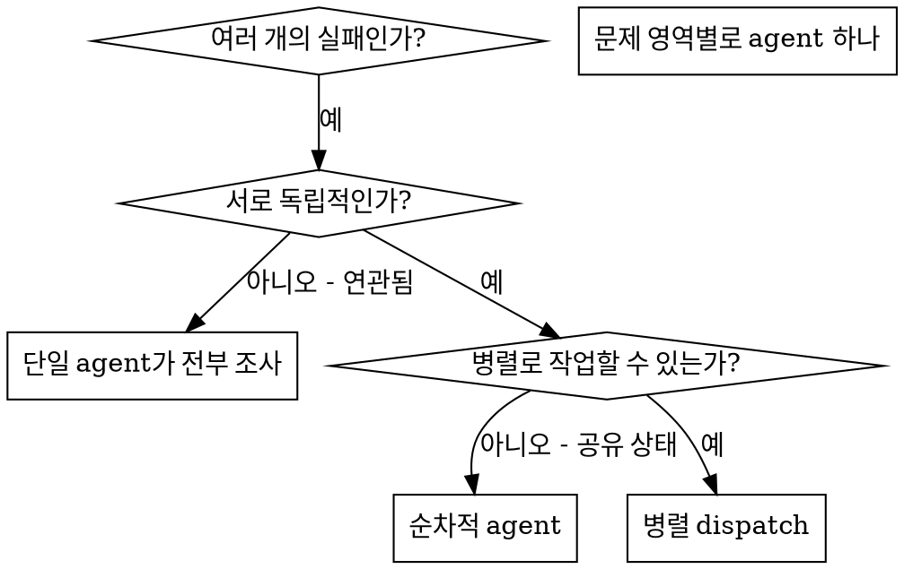

# Dispatching Parallel Agents

## 개요

격리된 context를 가진 전문화된 agent에게 작업을 위임합니다. 그들의 지시와 context를 정밀하게 작성함으로써, agent가 작업에 집중하고 성공하도록 보장합니다. 그들은 절대 당신 세션의 context나 히스토리를 상속받아서는 안 되며, 필요한 것을 정확하게 구성해 주어야 합니다. 이는 또한 조율 작업을 위한 당신 자신의 context를 보존합니다.

서로 관련 없는 여러 실패(다른 테스트 파일, 다른 서브시스템, 다른 버그)가 있을 때, 순차적으로 조사하는 것은 시간 낭비입니다. 각 조사는 독립적이며 parallel로 진행될 수 있습니다.

**핵심 원칙:** 독립적인 문제 도메인마다 하나의 agent를 dispatch하세요. 그들이 동시에 작업하도록 하세요.

## 사용 시점



**사용해야 할 때:**
- 서로 다른 근본 원인으로 3개 이상의 테스트 파일이 실패하는 경우
- 여러 서브시스템이 독립적으로 망가진 경우
- 각 문제를 다른 문제의 context 없이 이해할 수 있는 경우
- 조사 간에 공유 상태가 없는 경우

**사용하지 말아야 할 때:**
- 실패들이 서로 관련되어 있는 경우(하나를 고치면 다른 것도 고쳐질 수 있음)
- 전체 시스템 상태를 이해해야 하는 경우
- agent들이 서로 간섭할 수 있는 경우

## 패턴

### 1. 독립적인 도메인 식별

무엇이 망가졌는지로 실패를 그룹화하세요:
- 파일 A 테스트: Tool approval flow
- 파일 B 테스트: Batch completion behavior
- 파일 C 테스트: Abort functionality

각 도메인은 독립적입니다 - tool approval을 고치는 것이 abort 테스트에 영향을 주지 않습니다.

### 2. 집중된 Agent 작업 생성

각 agent는 다음을 받습니다:
- **구체적인 범위:** 하나의 테스트 파일 또는 서브시스템
- **명확한 목표:** 이 테스트들을 통과시키기
- **제약 조건:** 다른 코드는 변경하지 말 것
- **예상되는 출력:** 발견한 것과 고친 것의 요약

### 3. Parallel로 Dispatch

```typescript
// In Claude Code / AI environment
Task("Fix agent-tool-abort.test.ts failures")
Task("Fix batch-completion-behavior.test.ts failures")
Task("Fix tool-approval-race-conditions.test.ts failures")
// All three run concurrently
```

### 4. 검토 및 통합

agent들이 돌아왔을 때:
- 각 요약을 읽으세요
- 수정 사항이 충돌하지 않는지 확인하세요
- 전체 테스트 suite을 실행하세요
- 모든 변경 사항을 통합하세요

## Agent Prompt 구조

좋은 agent prompt는 다음과 같습니다:
1. **집중됨** - 하나의 명확한 문제 도메인
2. **자기 완결적** - 문제를 이해하는 데 필요한 모든 context 포함
3. **출력에 대해 구체적임** - agent가 무엇을 반환해야 하는가?

```markdown
src/agents/agent-tool-abort.test.ts의 실패하는 테스트 3개를 수정하세요:

1. "should abort tool with partial output capture" - 메시지에 'interrupted at'을 기대하지만 없음
2. "should handle mixed completed and aborted tools" - 빠른 tool이 완료되지 않고 abort됨
3. "should properly track pendingToolCount" - 결과 3개를 기대하지만 0개를 받음

이것들은 timing/race condition 문제입니다. 당신이 할 일:

1. 테스트 파일을 읽고 각 테스트가 무엇을 검증하는지 파악하세요
2. 근본 원인을 식별하세요 - timing 문제인가, 실제 bug인가?
3. 다음 방법으로 수정하세요:
   - 임의의 timeout을 event 기반 대기로 교체
   - abort 구현에 bug가 있다면 수정
   - 테스트 대상 동작이 바뀌었다면 테스트 기댓값을 조정

timeout을 늘리기만 하지 마세요 - 진짜 원인을 찾으세요.

반환할 것: 무엇을 발견했고 무엇을 수정했는지에 대한 요약.
```

## 흔한 실수

**❌ 너무 광범위함:** "모든 테스트를 고쳐줘" - agent가 길을 잃습니다
**✅ 구체적임:** "agent-tool-abort.test.ts를 고쳐줘" - 집중된 범위

**❌ Context 없음:** "race condition을 고쳐줘" - agent가 어디인지 모릅니다
**✅ Context 있음:** 오류 메시지와 테스트 이름을 붙여 넣으세요

**❌ 제약 조건 없음:** agent가 모든 것을 refactor할 수 있습니다
**✅ 제약 조건 있음:** "production 코드는 변경하지 마세요" 또는 "테스트만 수정하세요"

**❌ 모호한 출력:** "고쳐줘" - 무엇이 변경되었는지 모릅니다
**✅ 구체적임:** "근본 원인과 변경 사항의 요약을 반환하세요"

## 사용하지 말아야 할 때

**관련된 실패:** 하나를 고치면 다른 것도 고쳐질 수 있음 - 먼저 함께 조사하세요
**전체 context 필요:** 이해하려면 전체 시스템을 봐야 함
**탐색적 디버깅:** 아직 무엇이 망가졌는지 모름
**공유 상태:** agent들이 서로 간섭할 수 있음(같은 파일 편집, 같은 리소스 사용)

## 세션의 실제 사례

**시나리오:** 주요 refactoring 이후 3개 파일에 걸쳐 6개의 테스트 실패

**실패:**
- agent-tool-abort.test.ts: 3개 실패 (timing 문제)
- batch-completion-behavior.test.ts: 2개 실패 (tool이 실행되지 않음)
- tool-approval-race-conditions.test.ts: 1개 실패 (실행 횟수 = 0)

**결정:** 독립적인 도메인 - abort logic은 batch completion과 분리되어 있고 race conditions와도 분리됨

**Dispatch:**
```
Agent 1 → agent-tool-abort.test.ts 수정
Agent 2 → batch-completion-behavior.test.ts 수정
Agent 3 → tool-approval-race-conditions.test.ts 수정
```

**결과:**
- Agent 1: timeout을 event 기반 대기로 교체
- Agent 2: event 구조 버그 수정 (threadId가 잘못된 위치에 있었음)
- Agent 3: 비동기 tool 실행이 완료될 때까지 대기 추가

**통합:** 모든 수정 사항이 독립적이고, 충돌 없음, 전체 suite green

**절약된 시간:** 순차적으로 푸는 것 대비 3개 문제를 parallel로 해결

## 핵심 이점

1. **Parallelization** - 여러 조사가 동시에 진행됨
2. **집중** - 각 agent가 좁은 범위를 가지며, 추적할 context가 적음
3. **독립성** - agent들이 서로 간섭하지 않음
4. **속도** - 1개를 푸는 시간에 3개의 문제 해결

## 검증

agent들이 돌아온 후:
1. **각 요약 검토** - 무엇이 변경되었는지 이해하세요
2. **충돌 확인** - agent들이 같은 코드를 편집했는가?
3. **전체 suite 실행** - 모든 수정 사항이 함께 작동하는지 확인하세요
4. **표본 점검** - agent들은 체계적인 오류를 만들 수 있습니다

## 실제 영향

디버깅 세션에서 (2025-10-03):
- 3개 파일에 걸쳐 6개 실패
- 3개의 agent가 parallel로 dispatch됨
- 모든 조사가 동시에 완료됨
- 모든 수정 사항이 성공적으로 통합됨
- agent 변경 사항 간 충돌 zero
