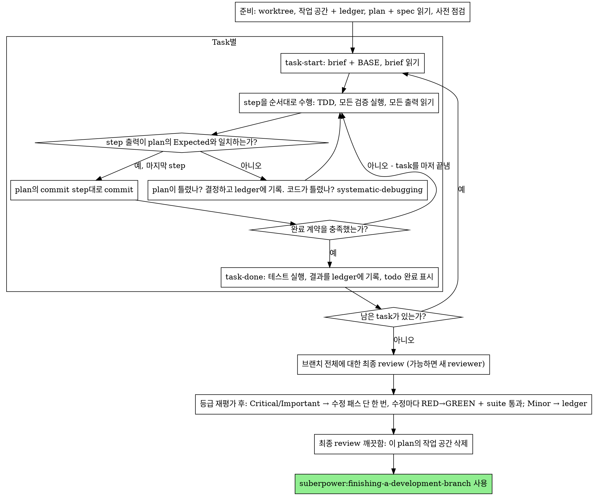

# Executing Plans

이 세션에서 plan을 task 하나씩 직접 실행합니다: task마다 implementer
subagent를 두지 않고, task마다 reviewer도 두지 않습니다. 마지막에 브랜치
전체를 새 context로 한 번 review합니다.

**왜 inline인가:** Subagent-driven development는 task마다 새 implementer와
새 reviewer의 비용을 치르고, 그 각각이 코드베이스를 처음부터 다시 읽습니다.
inline 실행은 context 하나(당신의 것)와 마지막 reviewer 하나의 비용만 듭니다.
그 대가로 포기하는 것은 task마다의 새 context와 task마다의 두 번째 눈입니다.
이 skill은 그 둘이 얻어 주던 것을 다른 수단으로 지킵니다: brief가 spec이고,
ledger가 당신의 기억이며, TDD가 task별 관문이고, 최종 reviewer가 두 번째
눈입니다.

**핵심 원칙:** 생각은 plan이 이미 끝냈습니다. plan을 정확히 실행하고, 각
step을 실패하는 것을 지켜본 뒤 통과시킨 테스트로 증명하고, 당신 자신이
잊어버려도 살아남는 기록을 남기세요.

**진행 서술:** tool 호출 사이의 서술은 많아야 짧은 한 줄로 하세요 — 기록은
ledger와 tool 결과가 담고 있습니다.

**지속적인 실행:** task 사이에 your human partner에게 확인받기 위해 멈추지
마세요. your human partner가 inline 실행을 택한 것은 비용을 줄이기 위해서이지,
매 task 후 "계속할까요?"에 답하기 위해서가 아닙니다. plan의 모든 task를 멈추지
않고 실행하세요.

**멈추지 말고 결정하세요.** 충돌, 모호함, plan의 결함 — 직접 결정하세요.
spec이 구속력 있는 기준이고, plan은 그 spec을 풀어낸 논증이며, 둘 다 답하지
못하는 것은 당신의 판단으로 정합니다. 모든 결정을 ledger에
`Ruling: <무엇을 결정했는가> — <이유> — <틀렸을 때 치르는 비용>` 형식으로
기록하고 계속 진행하세요. ledger에 기록한 결정 없이 plan에서 벗어나는 것은
몰래 내린 결정입니다.

당신을 멈춰 세우는 것은 다음 네 가지뿐입니다: 되돌릴 수 없거나 파괴적인 작업,
보안에 민감한 행동, 관례상 먼저 물어보는 이 worktree 밖의 부수 효과(merge,
공유 브랜치로의 push, 배포), 그리고 어느 길로 가든 추측일 수밖에 없을 만큼
망가진 plan. 이런 경우에는 멈추고 물어보세요.

## When to Use

- suberpower:writing-plans로 만든 plan이 있고, handoff에서 your human partner가
  inline 실행을 택한 경우.
- harness에 subagent tool이 없는 경우(플랫폼별 참고 문서
  `../using-suberpowers/references/` 참조). dispatch를 **절대** 꾸며 내지 말고,
  여기서 plan을 실행하세요.
- task들이 대체로 독립적인 경우 — suberpower:subagent-driven-development와
  같은 전제 조건입니다.

완전히 명세된 plan이라면 inline 실행은 옮겨 적기와 테스트일 뿐입니다: 중간
등급 세션 모델에서도 잘 돌아가며, 가장 강력한 모델이 제값을 하는 유일한 곳은
최종 review인데, 이 skill은 그것을 따로 dispatch합니다. your human partner가
inline을 택할 때 이 점을 알려 주세요.

your human partner가 모든 task에 review 관문을 원하거나, plan이 길어서 뒤쪽
task가 compaction된 context에서 실행될 정도라면
suberpower:subagent-driven-development를 우선하세요. 긴 plan도 inline으로
실행할 수는 있습니다 — 복구를 가능하게 하는 것은 ledger입니다 — 하지만 마지막
task들에는 당신의 여력이 가장 적게 남습니다.

## The Process



## Setup

작업이 격리된 작업 공간에서 이루어지도록 하세요:
suberpower:using-git-worktrees로 새로 만들거나 기존 것을 확인합니다.
your human partner의 명시적 동의 없이 main/master 브랜치에서 implementation을
절대 시작하지 마세요.

대화 기억은 compaction을 넘어 살아남지 못합니다. 자기 위치를 잃은 inline
실행자는 commit이 이미 있는 task를 다시 구현합니다 — controller가 그 task를
다시 dispatch하는 것과 같은 실패이며, 그 비용을 당신 자신의 context로 치릅니다.
진행 상황은 todo만이 아니라 ledger 파일에도 기록하세요. harness의 todo는 지금
상태를 보여 주는 화면이고, ledger는 기록입니다.

작업 공간과 ledger는 suberpower:subagent-driven-development와 공유합니다 —
같은 디렉터리, 같은 형식 — 그래서 plan 실행 도중에 실행 방식을 바꿔도 새
실행자가 같은 ledger에서 재개합니다.

- plan마다 작업 공간이 하나씩 있습니다: skill을 시작할 때
  `../subagent-driven-development/scripts/sdd-workspace PLAN_FILE`을 실행하세요
  — git이 무시하는 plan 전용 디렉터리
  (`<repo-root>/.suberpowers/sdd/<plan-basename>/`)를 출력하며, 여기에 **이**
  plan의 모든 산출물(ledger, brief, review package)이 들어갑니다. 다른 plan의
  디렉터리는 절대 읽거나 쓰지 마세요.
- 이 plan의 ledger가 `<workspace>/progress.md`에 있는지 확인하세요. 첫 줄이
  당신의 plan 파일을 가리킨다면, `Task <N>: complete` 줄이 있는 task는 DONE입니다
  — 다시 하지 말고, 그 줄이 없는 첫 task부터 재개하세요. 당신의 context가 그
  commit을 만든 기억을 잃어도 commit은 git에 남아 있습니다: compaction 후에는
  자신의 기억보다 ledger와 `git log`를 믿으세요. 첫 줄이 다른 plan 파일을
  가리키는 ledger는 다른 plan의 진행 기록입니다: 그대로 두고 당신의 ledger를
  새로 시작하세요.
- ledger를 만들 때 첫 줄에 그 정체를 적으세요:
  `# SDD ledger — plan: <plan 파일 경로>`.
- `git clean -fdx`는 작업 공간을 지웁니다(git이 무시하는 임시 공간이기
  때문입니다). 그렇게 되면 `git log`로 복구하세요.

plan을 한 번 읽고, context와 Global Constraints를 기록한 뒤, task마다 todo를
만드세요. plan이 Spec을 명시한다면 그것도 읽으세요: spec은 plan이 근거로 삼는
기준이며, plan 안의 충돌은 spec에 비추어 해결합니다. 도달할 수 있는 spec이 없는
plan이라면 ledger에 그렇다고 적으세요 — spec 없이 내린 결정은 잠정적입니다.

**REQUIRED SUB-SKILL:** 지금, Task 1 전에 suberpower:test-driven-development를
load하세요. 이 skill이 아래 모든 task의 모든 step을 지배합니다. step에 이미
"실패하는 테스트를 먼저 작성하라"고 적힌 plan이라도 이 skill을 읽지 않아도
되는 것은 아닙니다.

Task 1 전에 plan에서 task 간 충돌을 훑으세요. 어디를 볼지는 plan의 Interfaces
블록이 알려 줍니다: 앞선 task가 만드는 것을 소비하는 task마다 ledger에 한 행 —
두 task, 한쪽이 만드는 것과 다른 쪽이 소비하는 것, 그리고 발견한 것. 아무것도
공유하지 않는 task에는 행이 없습니다. task들이 아무것도 공유하지 않는 plan은
`Pre-flight: no shared interfaces` 한 줄만 적습니다. 행이 드러낸 충돌은 각각
spec을 구속력 있는 기준으로 삼아 결정하고, 그 행 옆에 결정을 기록한 뒤 Task 1을
시작하세요. 각 task 자체의 텍스트는 여기서가 아니라 그 brief를 읽을 때
점검합니다.

## The Task Loop

당신이 출력하는 모든 것과 모든 tool 결과는 세션이 끝날 때까지 당신의 context에
상주합니다. 긴 테스트 출력은 작업 공간의 파일로 리다이렉트하고 그 끝부분을
읽으세요. plan 전체가 아니라 brief를 읽으세요.

### 1. Take the task

- 이 skill의 `scripts/task-start PLAN_FILE N`을 실행하세요. brief 경로와
  BASE(task의 review 범위를 자르는 기준 commit)를 한 번의 호출로 출력합니다.
  준비 단계에서 기억하는 task를 포함해 모든 task의 brief를 읽으세요: 당신이
  기억하는 것은 요약이고, brief에는 정확한 값, signature, test case가 있습니다.
- task의 todo를 in_progress로 표시하세요.

모든 tool 호출은 당신의 context 전체를 다시 읽는 turn 하나입니다. 기록 작업은
실제 작업에 얹어서 하세요 — ledger 덧붙이기는 commit과 같은 호출에서 하고,
절대 별도 호출로 하지 마세요.

### 2. Work the steps

plan의 step은 이미 RED-GREEN 순서로 되어 있습니다. 준비 단계에서 load한
suberpower:test-driven-development에 따라 그 순서대로 진행하세요. 테스트 step의
코드를 먼저 작성하고 먼저 실행합니다. 실패를 지켜보는 것은 형식이 아니라 하나의
step입니다 — 구현이 존재하기도 전에 통과하는 테스트는 그 테스트에 대한 지적
사항입니다.

명령을 실행하는 모든 step에는 `Expected:` 줄이 있습니다. 명령을 실행하고,
출력을 읽고, 비교하세요. 결과는 세 가지입니다:

- **일치합니다.** 다음 step으로 넘어가세요.
- **코드가 틀렸습니다.** suberpower:systematic-debugging을 사용하세요. 원인을
  찾으세요. step의 출력을 맞추려고 증상을 땜질하는 일은 절대 하지 마세요.
- **plan이 틀렸습니다** — step이 spec과 모순되거나, 앞선 task의 인터페이스가
  이 task가 소비하는 것과 맞지 않거나, 명령이 애초에 동작할 수 없는 경우입니다.
  spec을 충족하는 가장 작은 변경을 결정하고,
  `Task <N>: Ruling: <지적 사항> — <무엇을 결정했고 왜>`로 ledger에 기록하고,
  계속하세요. 결정은 기억에 맡기지 않고 기록으로 전달합니다: 같은 인터페이스를
  건드리는 이후 task는 그 결정을 ledger에서 읽습니다.

plan의 commit step대로 commit하세요. 여러 commit에 걸친 task도 괜찮습니다.
BASE는 review 범위를 자르는 기준이며, 절대 `HEAD~1`이 아닙니다.

### 3. The completion contract

task의 ledger 줄을 쓰기 전에, 다음이 모두 참이어야 하며 그 증거가 이 세션에
있어야 합니다 — diff가 맞아 보인다는 데서 추론한 것으로는 안 됩니다:

- brief가 명시한 모든 테스트가 존재하고, 이 task에서 실행되었으며, 당신이 그
  출력을 읽었습니다.
- task의 마지막 테스트 실행이 통과했습니다 — `task-done`이 그 실행이며, 명령과
  결과를 ledger 줄에 적습니다.
- brief의 모든 `Expected:` 줄을 실제 출력과 비교했습니다.
- brief에서 벗어난 모든 것에 ledger의 `Ruling:` 줄이 있습니다.

**REQUIRED SUB-SKILL:** 완료 주장은 suberpower:verification-before-completion이
지배합니다. 하나라도 빠졌다면 task는 완료가 아닙니다: 마저 끝내세요.

### 4. Complete the task

brief가 task 전체에 대해 명시한 테스트 명령으로 이 skill의
`scripts/task-done PLAN_FILE N BASE -- <test command>`를 실행하세요. 테스트를
실행하고, 전체 출력을 작업 공간에 보관하고, 끝부분을 출력하며 — 통과했을 때만
— ledger에 완료 줄을 덧붙입니다:

`Task <N>: complete (commits <base7>..<head7>, tests: <command> → <result>)`

실패한 실행은 아무것도 기록하지 않습니다. 그 task는 완료가 아닙니다. 기록되면
todo를 완료로 표시하고 다음 task를 맡으세요.

## Final Review

`../subagent-driven-development/scripts/review-package PLAN_FILE MERGE_BASE HEAD`를
실행하고(MERGE_BASE = 브랜치가 시작된 commit, 예: `git merge-base main HEAD`)
출력된 파일을 보고 review하세요.

**subagent tool이 있을 때:** 사용 가능한 가장 강력한 모델로 reviewer를
dispatch하세요 — 브랜치 전체에 대한 review는 판단 task입니다.
suberpower:requesting-code-review의
[code-reviewer.md](../requesting-code-review/code-reviewer.md)를 사용하고,
package 경로, plan과 spec 경로, plan에 Review Focus 섹션이 있다면 그 섹션 원문
그대로(plan의 테스트가 다루지 않는 입력 유형과 실패 양상 — reviewer가 각각을
의도적으로 점검합니다), 그리고 당신이 내린 판단을 reviewer가 따져 볼 수 있도록
ledger의 `Ruling:` 줄을 가리키는 포인터를 넘기세요. 모델을 명시하세요. 모델을
생략하면 세션 모델을 상속하는데, 그것이 가장 강력한 모델이 아닐 수 있습니다.
이것이 이번 실행 전체가 비용을 치르고 얻는 유일한 새 context입니다. 건너뛰지
말고, 당신이 직접 diff를 읽는 것으로 대신하지 마세요.

**subagent tool이 없을 때:** code-reviewer.md를 읽고, 마지막 task의 ledger 줄
이후 별도의 패스로 package를 대상으로 그 review를 직접 수행하세요. ledger에
`Final review: self-review (no subagent tool)`를 쓰고, 최종 메시지에서도 그렇게
밝히세요: 작성자 본인의 self-review는 새 reviewer보다 약하며, merge 전에 그것으로
충분한지는 your human partner가 결정합니다.

지적 사항에 대해 행동하기 전에 먼저 분류하세요. reviewer의 심각도 라벨은
조언이고, 관문은 당신의 몫입니다. reviewer의 "Declined to judge" 목록도 당신의
몫입니다: 거기 있는 모든 줄은 plan의 충돌과 똑같이 당신이 결정하고 ledger에
기록할 결정입니다 — `Final: Ruling: <reviewer가 판단에서 제외한 동작> —
<이 소프트웨어를 쓰는 합리적인 사람이 겪는 것, 그리고 그것이 그대로 유지되는
이유 또는 이제 지적 사항이 되는 이유> — <틀렸을 때 치르는 비용>`. 먼저 효과를
기준으로 등급을 다시 매기세요: spec은 비전 문서이며, 지적 사항의 등급은 spec이
그것을 일으키는 입력을 명시했는지가 아니라, 이대로 출시되었을 때 이 소프트웨어를
쓰는 합리적인 사람이 겪는 결과입니다 — spec이 침묵했다는 이유로 지적 사항을
Minor로 매긴 reviewer는 효과가 아니라 spec을 채점한 것입니다. 그런 다음:

- **Critical과 Important**는 수정 패스에 들어갑니다.
- **Minor**는 ledger에 `Final: minor (deferred): <한 줄 요약>`으로 기록하고,
  최종 메시지의 "Deferred minors(연기된 Minor)" 아래에 적습니다. Minor는 절대
  수정 패스에 들어가지 않으며, 절대 결정이 되지 않습니다 — 결정은 충돌에 대한
  판단이지, 다듬기 제안을 거절했다는 메모가 아닙니다.

Critical과 Important 지적 사항은 당신이 직접 고치세요 — 여기서는 당신이
implementer입니다 — **단 한 번의** 패스로. 각 수정은 두 번째 reviewer가 아니라
TDD로 검증합니다: 지적 사항을 재현하는 테스트를 작성하고, 실패를 지켜보고,
통과시킨 뒤, 전체 suite를 실행하세요. 각각을 ledger에
`Final: fixed <지적 사항> — <테스트 이름> RED→GREEN, suite <N>/<N>`으로
기록하세요. 먼저 실패한 테스트가 없는 수정은 검증되지 않은 것이고, 패스 후
suite가 통과하지 않았다면 패스는 끝나지 않은 것입니다. re-review를 dispatch하지
마세요: "해결되었는가"에는 수정을 커버하는 테스트가 이미 답했고 "깨뜨린 것이
없는가"에는 suite 실행이 이미 답한 diff를 다시 읽을 뿐입니다.

고치지 않기로 한 지적 사항은 결정입니다 — `Final: Ruling: <지적 사항> —
<코드를 그대로 두는 이유> — <틀렸을 때 치르는 비용>` — 그리고 결정 목록을 통해
your human partner에게 전달됩니다. 두 번째 수정 패스는 없습니다.

## Finish

무엇이든 지우기 전에, `Ruling:`이 들어 있는 ledger의 모든 줄을 모아 최종
메시지의 "Rulings I made(내가 내린 결정)" 아래에 내린 순서대로, 각각 틀렸을 때
치르는 비용과 함께 적고, 모든 `minor (deferred)` 줄은 "Deferred minors" 아래에
적으세요. 두 목록 모두 빠짐이 없어야 합니다. 당신이 your human partner를 대신해
내린 결정 — 그리고 행동하지 않기로 한 지적 사항 — 이 your human partner에게
닿는 유일한 통로는 당신의 최종 메시지입니다.

최종 review가 깨끗하고 그 수정이 commit되면, 이 plan의 작업 공간 디렉터리를
삭제하세요 — 이제 git 히스토리가 기록입니다. 형제 디렉터리는 다른 plan의
것입니다. 건드리지 마세요.

suberpower:finishing-a-development-branch를 사용하세요.

## Common Rationalizations

| 핑계 | 현실 |
|--------|---------|
| "Task N이 뭐라고 하는지 기억한다" | 당신이 기억하는 것은 요약입니다. brief에는 정확한 값이 있습니다. 읽으세요. |
| "plan의 코드가 맞으니 테스트 실패를 지켜보는 건 건너뛰자" | 실패하는 것을 한 번도 보지 못한 테스트는 아무것도 증명하지 못합니다. step 하나일 뿐입니다. 실행하세요. |
| "step마다 돌리지 말고 마지막에 전체 suite를 돌리겠다" | step별 실행이 어느 step이 깨뜨렸는지 알아내는 방법입니다. task 끝의 실행은 계약이지, 대체물이 아닙니다. |
| "여기는 plan이 틀렸으니, 그냥 옳은 대로 하겠다" | 옳은 대로 하고 그 결정을 ledger에 기록하세요. ledger에 없는 이탈은 몰래 내린 결정입니다. |
| "ledger 줄은 task 몇 개 끝나고 쓰겠다" | compaction은 편한 때를 기다려 주지 않습니다. task마다 한 줄, commit과 같은 메시지에서 쓰세요. |
| "다음 task 전에 확인받자" | your human partner는 비용을 줄이려고 inline을 택했습니다. 진행 확인 질문은 그 대신 your human partner의 시간을 씁니다. 네 가지 멈춤 사유만 당신을 멈춰 세웁니다. |
| "내 diff를 꼼꼼히 읽었으니 최종 reviewer는 불필요하다" | 같은 작성자, 같은 맹점입니다. reviewer는 이번 실행이 얻는 유일한 새 context입니다. |
| "변경이 사소했으니 테스트는 통과할 것이다" | "~할 것이다"는 증거가 아닙니다. 계약은 명령과 그 출력을 요구합니다. |
| "subagent는 느리고 비싸니 최종 review도 건너뛰자" | inline은 이미 task별 reviewer를 없앴습니다. 브랜치 전체에 대한 review 한 번은 상한이 아니라 하한입니다. |
| "reviewer가 Minor라고 했으니 Minor다" | 그 라벨은 spec의 침묵을 채점한 것입니다. 사람이 겪는 것을 기준으로 등급을 매기세요. 등급을 다시 매긴 뒤 관문을 적용하세요. |
| "수정이 뻔하니 실패하는 테스트를 먼저 쓸 필요가 없다" | 실패하는 테스트만이 지적 사항이 실제였고 이제 사라졌다는 유일한 증거입니다. 그것 없이는 diff와 희망뿐입니다. |
| "들어간 김에 minor도 고치겠다" | 당신이 고치는 minor 하나하나가 your human partner가 요청하지 않은 테스트, 수정, suite 실행입니다. ledger에 기록하세요. 결정은 your human partner가 합니다. |

## Example Workflow

```
You: 이 plan을 inline으로 구현하기 위해 executing-plans skill을 사용합니다.

[준비: worktree 확인됨]
[plan을 한 번 읽음: docs/suberpowers/plans/feature-plan.md; spec 읽음]
[작업 공간 확인: sdd-workspace docs/suberpowers/plans/feature-plan.md — 안에 ledger 없음, 새로 시작]
[사전 점검: 공유 인터페이스 행 2개, 자기 일관성 행 4개, 깨끗함; ledger에 기록]
[모든 task로 todo 생성]

Task 1: Hook 설치 스크립트

[task-start plan 1 → brief 읽음; BASE a1b2c3d]
[Step 1: 실패하는 테스트 작성 — 작성함]
[Step 2: 실행 — FAIL: install_hook not defined. Expected와 일치.]
[Step 3: 구현 — 작성함]
[Step 4: 실행 — PASS 1/1. Expected와 일치.]
[Step 5: commit — d4e5f6a]
[계약: 테스트 실행함, 출력 읽음, 이탈 없음]
[task-done plan 1 a1b2c3d -- npm test -- hooks → ledger: Task 1: complete (commits a1b2c3d..d4e5f6a, tests: npm test -- hooks → 1/1 pass)]

Task 2: 복구 모드

[task-start plan 2 → brief 읽음; BASE d4e5f6a]
[Step 2: 실패하는 테스트 실행 — FAIL, 그런데 import 오류: Task 1은
 installHook을 export했는데 brief는 install_hook을 소비함]
[결정: brief의 소비 측 이름은 Task 1의 Produces 블록과 어긋나는 오타;
 installHook 사용 — Ledger: Task 2: Ruling: install_hook → installHook — Task 1 Produces와 일치 — 틀렸을 때 비용: 이름 변경 한 번]
[Steps 2-5 계획대로; commit b7c8d9e]
[task-done plan 2 d4e5f6a -- npm test -- recovery → ledger: Task 2: complete (commits d4e5f6a..b7c8d9e, tests: npm test -- recovery → 8/8 pass)]

...

[모든 task 완료 후: review-package plan MERGE_BASE HEAD; 가장 강력한 모델로 code-reviewer dispatch]
Reviewer: Important 지적 사항 하나 — 진행 상황 보고 간격이 하드코딩됨. Minor 둘.
[등급 재평가: Important 유지; minor는 연기로 ledger에 기록]
[수정 패스: test_progress_interval_configurable RED → PROGRESS_INTERVAL 추출 → GREEN; suite 12/12; commit]
[Ledger: Final: fixed 하드코딩된 간격 — test_progress_interval_configurable RED→GREEN, suite 12/12]

Rulings I made(내가 내린 결정):
- Task 2: install_hook → installHook (brief 오타; 틀렸을 때 비용: 이름 변경 한 번)

Deferred minors(연기된 Minor):
- README에 사용 예시가 없음
- recovery.js의 verify/repair를 두 파일로 나눌 수 있음

[이 plan의 작업 공간 삭제 — 이제 기록은 git에 있음]

suberpower:finishing-a-development-branch를 사용합니다.
```
