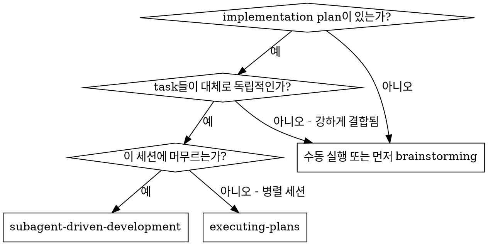
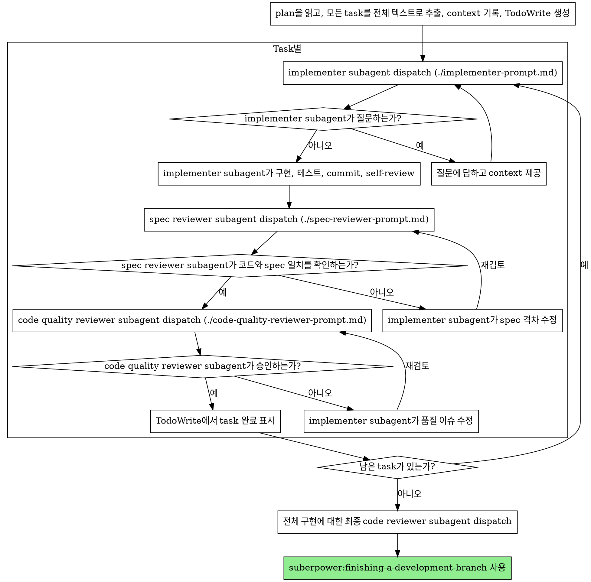

# Subagent-Driven Development

각 task마다 새로운 subagent를 dispatch하여 plan을 실행하고, 각 task 후에는 두 단계의 review를 수행합니다 — 먼저 spec 준수 review, 그다음 code quality review입니다.

**왜 subagent를 사용하는가:** 격리된 context를 가진 전문 agent에게 task를 위임합니다. 지시문과 context를 정밀하게 구성함으로써, 해당 agent가 집중력을 유지하고 task를 성공적으로 수행하도록 보장합니다. subagent는 절대 당신의 세션 context나 히스토리를 상속받아서는 안 됩니다 — 필요한 것을 정확히 구성해서 전달해야 합니다. 이를 통해 당신 자신의 context도 조율 작업을 위해 보존됩니다.

**핵심 원칙:** task마다 새로운 subagent + 두 단계 review(spec → quality) = 높은 품질과 빠른 반복

**지속적인 실행:** task 사이에 your human partner에게 확인받기 위해 멈추지 마세요. plan의 모든 task를 멈추지 않고 실행하세요. 멈춰야 할 유일한 이유는 다음과 같습니다: 해결할 수 없는 BLOCKED 상태, 진행을 실제로 막는 모호함, 모든 task 완료. "계속할까요?" 같은 질문이나 진행 요약은 사용자의 시간을 낭비합니다 — 그들은 plan을 실행해달라고 요청한 것이므로, 그냥 실행하세요.

## 언제 사용하는가



**Executing Plans(병렬 세션)와의 비교:**
- 같은 세션 (context 전환 없음)
- task마다 새로운 subagent (context 오염 없음)
- 각 task 후 두 단계 review: spec 준수 먼저, 그다음 code quality
- 더 빠른 반복 (task 사이에 사람 개입 없음)

## 프로세스



## 모델 선택

비용을 절감하고 속도를 높이기 위해 각 역할을 처리할 수 있는 가장 약한 모델을 사용하세요.

**기계적인 implementation task** (격리된 함수, 명확한 spec, 1-2개 파일): 빠르고 저렴한 모델을 사용하세요. plan이 잘 명세되어 있으면 대부분의 implementation task는 기계적입니다.

**통합 및 판단 task** (다중 파일 조율, 패턴 매칭, 디버깅): 표준 모델을 사용하세요.

**아키텍처, 설계, review task**: 사용 가능한 가장 강력한 모델을 사용하세요.

**Task 복잡도 신호:**
- 완전한 spec과 함께 1-2개 파일에 영향 → 저렴한 모델
- 통합 관심사가 있는 여러 파일에 영향 → 표준 모델
- 설계 판단이나 광범위한 코드베이스 이해 필요 → 가장 강력한 모델

## Implementer 상태 처리

Implementer subagent는 네 가지 상태 중 하나를 보고합니다. 각각을 적절히 처리하세요.

**DONE:** spec 준수 review로 진행합니다.

**DONE_WITH_CONCERNS:** implementer가 작업을 완료했지만 우려 사항을 표시했습니다. 진행하기 전에 그 우려 사항을 읽어보세요. 우려가 정확성이나 범위에 관한 것이라면 review 전에 해결하세요. 단순한 관찰(예: "이 파일이 커지고 있다")이라면 메모해두고 review로 진행하세요.

**NEEDS_CONTEXT:** implementer가 제공받지 못한 정보가 필요합니다. 누락된 context를 제공하고 다시 dispatch하세요.

**BLOCKED:** implementer가 task를 완료할 수 없습니다. blocker를 평가하세요:
1. context 문제라면 더 많은 context를 제공하고 같은 모델로 다시 dispatch합니다
2. task에 더 많은 추론이 필요하다면 더 강력한 모델로 다시 dispatch합니다
3. task가 너무 크다면 더 작은 조각으로 나눕니다
4. plan 자체가 잘못되었다면 사람에게 escalate합니다

escalate를 **절대** 무시하거나 변경 없이 같은 모델에게 재시도를 강요하지 마세요. implementer가 막혔다고 말했다면 무언가가 바뀌어야 합니다.

## Prompt 템플릿

- `./implementer-prompt.md` - implementer subagent dispatch용
- `./spec-reviewer-prompt.md` - spec 준수 reviewer subagent dispatch용
- `./code-quality-reviewer-prompt.md` - code quality reviewer subagent dispatch용

## 예시 워크플로우

```
You: 이 plan을 실행하기 위해 Subagent-Driven Development를 사용합니다.

[plan 파일을 한 번 읽음: docs/suberpowers/plans/feature-plan.md]
[5개 task를 전체 텍스트와 context와 함께 추출]
[모든 task로 TodoWrite 생성]

Task 1: Hook 설치 스크립트

[Task 1의 텍스트와 context 확보 (이미 추출됨)]
[전체 task 텍스트 + context와 함께 implementation subagent dispatch]

Implementer: "시작하기 전에 — hook을 user 레벨에 설치해야 하나요, 아니면 system 레벨에 설치해야 하나요?"

You: "User 레벨입니다 (~/.config/suberpowers/hooks/)"

Implementer: "알겠습니다. 지금 구현합니다..."
[잠시 후] Implementer:
  - install-hook 명령 구현
  - 테스트 추가, 5/5 통과
  - self-review: --force flag를 빠뜨린 것을 발견해 추가함
  - Commit 완료

[spec 준수 reviewer dispatch]
Spec reviewer: ✅ Spec 준수 - 모든 요구사항 충족, 추가된 것 없음

[git SHA 확보, code quality reviewer dispatch]
Code reviewer: Strengths: 좋은 테스트 커버리지, 깔끔함. Issues: 없음. 승인.

[Task 1 완료 표시]

Task 2: 복구 모드

[Task 2의 텍스트와 context 확보 (이미 추출됨)]
[전체 task 텍스트 + context와 함께 implementation subagent dispatch]

Implementer: [질문 없이 진행]
Implementer:
  - verify/repair 모드 추가
  - 8/8 테스트 통과
  - self-review: 모두 양호
  - Commit 완료

[spec 준수 reviewer dispatch]
Spec reviewer: ❌ 이슈 발견:
  - 누락: 진행 상황 보고 (spec에 "100개 항목마다 보고"라고 명시됨)
  - 추가: --json flag 추가됨 (요청되지 않음)

[Implementer가 이슈 수정]
Implementer: --json flag 제거, 진행 상황 보고 추가

[Spec reviewer가 다시 review]
Spec reviewer: ✅ 이제 Spec 준수

[code quality reviewer dispatch]
Code reviewer: Strengths: 견고함. Issues (Important): 매직 넘버 (100)

[Implementer가 수정]
Implementer: PROGRESS_INTERVAL 상수로 추출

[Code reviewer가 다시 review]
Code reviewer: ✅ 승인

[Task 2 완료 표시]

...

[모든 task 완료 후]
[최종 code-reviewer dispatch]
Final reviewer: 모든 요구사항 충족, merge 준비 완료

완료!
```

## 장점

**수동 실행과의 비교:**
- subagent가 자연스럽게 TDD를 따름
- task마다 fresh context (혼동 없음)
- 병렬 안전 (subagent끼리 간섭하지 않음)
- subagent가 질문 가능 (작업 시작 전 그리고 작업 중에도)

**Executing Plans와의 비교:**
- 같은 세션 (핸드오프 없음)
- 지속적인 진행 (대기 없음)
- 자동 review 체크포인트

**효율성 이득:**
- 파일 읽기 오버헤드 없음 (controller가 전체 텍스트 제공)
- controller가 필요한 context만 정확히 큐레이션
- subagent가 완전한 정보를 미리 받음
- 작업 시작 전 질문이 드러남 (작업 후가 아님)

**품질 게이트:**
- self-review로 핸드오프 전에 이슈 발견
- 두 단계 review: spec 준수, 그다음 code quality
- review 루프로 수정이 실제로 작동하는지 확인
- spec 준수로 과잉 구현과 구현 누락을 방지
- code quality로 구현이 잘 만들어지도록 보장

**비용:**
- 더 많은 subagent 호출 (task당 implementer + reviewer 2개)
- controller가 더 많은 준비 작업 수행 (모든 task를 미리 추출)
- review 루프로 반복 추가
- 하지만 이슈를 일찍 잡음 (나중에 디버깅하는 것보다 저렴)

## 위험 신호

**절대 하지 말 것:**
- 사용자의 명시적 동의 없이 main/master branch에서 implementation 시작
- review 건너뛰기 (spec 준수 또는 code quality)
- 수정되지 않은 이슈로 진행
- 여러 implementation subagent를 병렬로 dispatch (충돌 발생)
- subagent에게 plan 파일을 읽게 하기 (대신 전체 텍스트 제공)
- 배경 설명 context 건너뛰기 (subagent는 task가 전체에서 어디에 속하는지 이해해야 함)
- subagent 질문 무시 (진행시키기 전에 답변)
- spec 준수에서 "충분히 가까움"을 받아들이기 (spec reviewer가 이슈를 발견 = 완료 아님)
- review 루프 건너뛰기 (reviewer가 이슈 발견 = implementer 수정 = 다시 review)
- implementer의 self-review가 실제 review를 대체하게 하기 (둘 다 필요함)
- **spec 준수가 ✅ 되기 전에 code quality review 시작** (잘못된 순서)
- 어느 review라도 미해결 이슈가 있는데 다음 task로 이동

**subagent가 질문할 때:**
- 명확하고 완전하게 답변
- 필요하면 추가 context 제공
- implementation으로 서두르지 말 것

**reviewer가 이슈를 발견하면:**
- implementer(같은 subagent)가 수정
- reviewer가 다시 review
- 승인될 때까지 반복
- 재review를 건너뛰지 말 것

**subagent가 task에 실패하면:**
- 구체적인 지시와 함께 fix subagent를 dispatch
- 수동으로 수정하려 하지 말 것 (context 오염)

## 통합

**필수 워크플로우 skill:**
- **suberpower:using-git-worktrees** - 격리된 작업 공간 보장 (새로 만들거나 기존 것 확인)
- **suberpower:writing-plans** - 이 skill이 실행할 plan을 생성
- **suberpower:requesting-code-review** - reviewer subagent를 위한 code review 템플릿
- **suberpower:finishing-a-development-branch** - 모든 task 후 개발 완료

**subagent가 사용해야 할 것:**
- **suberpower:test-driven-development** - subagent는 각 task마다 TDD를 따름

**대안 워크플로우:**
- **suberpower:executing-plans** - 같은 세션 실행 대신 병렬 세션에 사용
