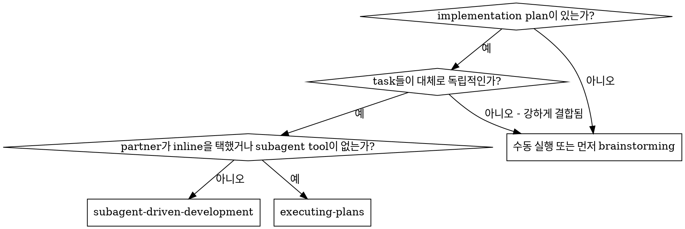
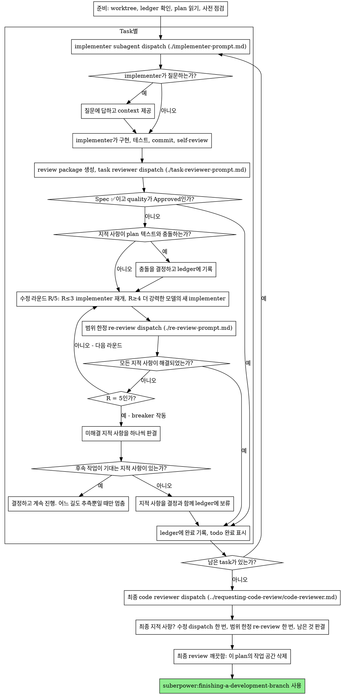

# Subagent-Driven Development

task마다 새로운 implementer subagent를 dispatch하고, 각 task 후에는 task review(spec 준수 + code quality)를, 마지막에는 브랜치 전체에 대한 폭넓은 review를 한 번 수행하여 plan을 실행합니다.

**왜 subagent를 사용하는가:** 격리된 context를 가진 전문 agent에게 task를 위임합니다. 지시문과 context를 정밀하게 구성함으로써, 해당 agent가 집중력을 유지하고 task를 성공적으로 수행하도록 보장합니다. subagent는 절대 당신의 세션 context나 히스토리를 상속받아서는 안 됩니다 — 필요한 것을 정확히 구성해서 전달해야 합니다. 이를 통해 당신 자신의 context도 조율 작업을 위해 보존됩니다.

**핵심 원칙:** task마다 새로운 subagent + task review(spec + quality) + 폭넓은 최종 review = 높은 품질과 빠른 반복

**진행 서술:** tool 호출 사이의 서술은 많아야 짧은 한 줄로 하세요 — 기록은
ledger와 tool 결과가 담고 있습니다.

**지속적인 실행:** task 사이에 your human partner에게 확인받기 위해 멈추지 마세요. plan의 모든 task를 멈추지 않고 실행하세요. 멈춰야 할 유일한 이유는 아래에 적은 네 가지, 또는 모든 task 완료입니다. "계속할까요?" 같은 질문이나 진행 요약은 사용자의 시간을 낭비합니다 — 그들은 plan을 실행해달라고 요청한 것이므로, 그냥 실행하세요.

**멈추지 말고 결정하세요.** 실행 중인 plan은 사람을 기다리지 않습니다. 충돌,
모호함, plan의 결함, 넘어도 되는지 물어보고 싶었던 한도 — 직접 결정하세요.
spec이 구속력 있는 기준이고, plan은 그 spec을 풀어낸 논증이며, 둘 다 답하지
못하는 것은 당신의 판단으로 정합니다. 모든 결정을 ledger에
`Ruling: <무엇을 결정했는가> — <이유> — <틀렸을 때 치르는 비용>` 형식으로
기록하고 계속 진행하세요. 잘못된 결정은 your human partner가 보고 되돌릴 수 있는
재작업을 남길 뿐이지만, 질문 하나에 멈춰 선 세션은 그들의 하루를 통째로 날리고
아무것도 얻지 못합니다.

당신을 멈춰 세우는 것은 다음 네 가지뿐입니다: 되돌릴 수 없거나 파괴적인 작업,
보안에 민감한 행동, 관례상 먼저 물어보는 이 worktree 밖의 부수 효과(merge,
공유 브랜치로의 push, 배포), 그리고 어느 길로 가든 추측일 수밖에 없을 만큼
망가진 plan. 이런 경우에는 멈추고 물어보세요.

## 언제 사용하는가


```dot
digraph when_to_use {
    "implementation plan이 있는가?" [shape=diamond];
    "task들이 대체로 독립적인가?" [shape=diamond];
    "partner가 inline을 택했거나 subagent tool이 없는가?" [shape=diamond];
    "subagent-driven-development" [shape=box];
    "executing-plans" [shape=box];
    "수동 실행 또는 먼저 brainstorming" [shape=box];

    "implementation plan이 있는가?" -> "task들이 대체로 독립적인가?" [label="예"];
    "implementation plan이 있는가?" -> "수동 실행 또는 먼저 brainstorming" [label="아니오"];
    "task들이 대체로 독립적인가?" -> "partner가 inline을 택했거나 subagent tool이 없는가?" [label="예"];
    "task들이 대체로 독립적인가?" -> "수동 실행 또는 먼저 brainstorming" [label="아니오 - 강하게 결합됨"];
    "partner가 inline을 택했거나 subagent tool이 없는가?" -> "executing-plans" [label="예"];
    "partner가 inline을 택했거나 subagent tool이 없는가?" -> "subagent-driven-development" [label="아니오"];
}
```

**Executing Plans(inline)와의 비교:**
- 하나의 context가 모든 task를 처리하는 대신 task마다 새로운 subagent (context 오염 없음)
- 마지막에만 review하는 대신 각 task 후 review (spec 준수 + code quality)
- task마다, review마다 새 context 비용이 듭니다. inline은 context 하나와 최종 reviewer 하나의 비용이 듭니다
- 둘 다 이 세션에서 실행되고, 같은 plan 작업 공간과 ledger를 공유하며, task 사이에 멈추지 않습니다

## 프로세스


```dot
digraph process {
    rankdir=TB;

    subgraph cluster_per_task {
        label="Task별";
        "implementer subagent dispatch (./implementer-prompt.md)" [shape=box];
        "implementer가 질문하는가?" [shape=diamond];
        "질문에 답하고 context 제공" [shape=box];
        "implementer가 구현, 테스트, commit, self-review" [shape=box];
        "review package 생성, task reviewer dispatch (./task-reviewer-prompt.md)" [shape=box];
        "Spec ✅이고 quality가 Approved인가?" [shape=diamond];
        "지적 사항이 plan 텍스트와 충돌하는가?" [shape=diamond];
        "충돌을 결정하고 ledger에 기록" [shape=box];
        "수정 라운드 R/5: R≤3 implementer 재개, R≥4 더 강력한 모델의 새 implementer" [shape=box];
        "범위 한정 re-review dispatch (./re-review-prompt.md)" [shape=box];
        "모든 지적 사항이 해결되었는가?" [shape=diamond];
        "R = 5인가?" [shape=diamond];
        "미해결 지적 사항을 하나씩 판결" [shape=box];
        "후속 작업이 기대는 지적 사항이 있는가?" [shape=diamond];
        "결정하고 계속 진행. 어느 길도 추측뿐일 때만 멈춤" [shape=box];
        "지적 사항을 결정과 함께 ledger에 보류" [shape=box];
        "ledger에 완료 기록, todo 완료 표시" [shape=box];
    }

    "준비: worktree, ledger 확인, plan 읽기, 사전 점검" [shape=box];
    "남은 task가 있는가?" [shape=diamond];
    "최종 code reviewer dispatch (../requesting-code-review/code-reviewer.md)" [shape=box];
    "최종 지적 사항? 수정 dispatch 한 번, 범위 한정 re-review 한 번, 남은 것 판결" [shape=box];
    "최종 review 깨끗함: 이 plan의 작업 공간 삭제" [shape=box];
    "suberpower:finishing-a-development-branch 사용" [shape=box style=filled fillcolor=lightgreen];

    "준비: worktree, ledger 확인, plan 읽기, 사전 점검" -> "implementer subagent dispatch (./implementer-prompt.md)";
    "implementer subagent dispatch (./implementer-prompt.md)" -> "implementer가 질문하는가?";
    "implementer가 질문하는가?" -> "질문에 답하고 context 제공" [label="예"];
    "질문에 답하고 context 제공" -> "implementer가 구현, 테스트, commit, self-review";
    "implementer가 질문하는가?" -> "implementer가 구현, 테스트, commit, self-review" [label="아니오"];
    "implementer가 구현, 테스트, commit, self-review" -> "review package 생성, task reviewer dispatch (./task-reviewer-prompt.md)";
    "review package 생성, task reviewer dispatch (./task-reviewer-prompt.md)" -> "Spec ✅이고 quality가 Approved인가?";
    "Spec ✅이고 quality가 Approved인가?" -> "ledger에 완료 기록, todo 완료 표시" [label="예"];
    "Spec ✅이고 quality가 Approved인가?" -> "지적 사항이 plan 텍스트와 충돌하는가?" [label="아니오"];
    "지적 사항이 plan 텍스트와 충돌하는가?" -> "충돌을 결정하고 ledger에 기록" [label="예"];
    "충돌을 결정하고 ledger에 기록" -> "수정 라운드 R/5: R≤3 implementer 재개, R≥4 더 강력한 모델의 새 implementer";
    "지적 사항이 plan 텍스트와 충돌하는가?" -> "수정 라운드 R/5: R≤3 implementer 재개, R≥4 더 강력한 모델의 새 implementer" [label="아니오"];
    "수정 라운드 R/5: R≤3 implementer 재개, R≥4 더 강력한 모델의 새 implementer" -> "범위 한정 re-review dispatch (./re-review-prompt.md)";
    "범위 한정 re-review dispatch (./re-review-prompt.md)" -> "모든 지적 사항이 해결되었는가?";
    "모든 지적 사항이 해결되었는가?" -> "ledger에 완료 기록, todo 완료 표시" [label="예"];
    "모든 지적 사항이 해결되었는가?" -> "R = 5인가?" [label="아니오"];
    "R = 5인가?" -> "수정 라운드 R/5: R≤3 implementer 재개, R≥4 더 강력한 모델의 새 implementer" [label="아니오 - 다음 라운드"];
    "R = 5인가?" -> "미해결 지적 사항을 하나씩 판결" [label="예 - breaker 작동"];
    "미해결 지적 사항을 하나씩 판결" -> "후속 작업이 기대는 지적 사항이 있는가?";
    "후속 작업이 기대는 지적 사항이 있는가?" -> "결정하고 계속 진행. 어느 길도 추측뿐일 때만 멈춤" [label="예"];
    "후속 작업이 기대는 지적 사항이 있는가?" -> "지적 사항을 결정과 함께 ledger에 보류" [label="아니오"];
    "지적 사항을 결정과 함께 ledger에 보류" -> "ledger에 완료 기록, todo 완료 표시";
    "ledger에 완료 기록, todo 완료 표시" -> "남은 task가 있는가?";
    "남은 task가 있는가?" -> "implementer subagent dispatch (./implementer-prompt.md)" [label="예"];
    "남은 task가 있는가?" -> "최종 code reviewer dispatch (../requesting-code-review/code-reviewer.md)" [label="아니오"];
    "최종 code reviewer dispatch (../requesting-code-review/code-reviewer.md)" -> "최종 지적 사항? 수정 dispatch 한 번, 범위 한정 re-review 한 번, 남은 것 판결";
    "최종 지적 사항? 수정 dispatch 한 번, 범위 한정 re-review 한 번, 남은 것 판결" -> "최종 review 깨끗함: 이 plan의 작업 공간 삭제";
    "최종 review 깨끗함: 이 plan의 작업 공간 삭제" -> "suberpower:finishing-a-development-branch 사용";
}
```

## 준비

작업이 격리된 작업 공간에서 이루어지도록 하세요:
suberpower:using-git-worktrees로 새로 만들거나 기존 것을 확인합니다.
your human partner의 명시적 동의 없이 main/master 브랜치에서 implementation을
절대 시작하지 마세요.

대화 기억은 compaction을 넘어 살아남지 못합니다. 실제 세션에서 자기 위치를
잃은 controller가 이미 끝난 task 묶음 전체를 다시 dispatch한 일이 있습니다 —
관찰된 실패 중 가장 비싼 것입니다. 진행 상황은 todo만이 아니라 ledger 파일에도
기록하세요.

- plan마다 작업 공간이 하나씩 있습니다: skill을 시작할 때 이 skill의
  `bash scripts/sdd-workspace PLAN_FILE`을 실행하세요 — git이 무시하는 plan
  전용 디렉터리(`<repo-root>/.suberpowers/sdd/` 아래)를 출력하며, 여기에 **이**
  plan의 모든 산출물(ledger, brief, 보고서, review package)이 들어갑니다.
  다른 plan의 디렉터리는 절대 읽거나 쓰지 마세요.
- 이 plan의 ledger가 `<workspace>/progress.md`에 있는지 확인하세요. 첫 줄이
  당신의 plan 파일을 가리킨다면, `Task <N>: complete` 줄이 있는 task는 DONE입니다
  — 다시 dispatch하지 말고, 그 줄이 없는 첫 task부터 재개하세요. 마지막 줄이
  수정 라운드인 task는 루프 도중에 있는 것입니다: 다음 라운드부터 루프를
  재개하세요. 첫 줄이 다른 plan 파일을 가리키는 ledger — 또는 예전 평면 경로
  `.suberpowers/sdd/progress.md`에 남은 ledger — 는 다른 plan의 진행 기록입니다:
  그대로 두고 당신의 ledger를 새로 시작하세요.
- ledger를 만들 때 첫 줄에 그 정체를 적으세요:
  `# SDD ledger — plan: <plan 파일 경로>`.
- ledger는 복구 지도입니다: 당신의 context가 그것을 만든 기억을 잃어도,
  ledger가 가리키는 commit은 git에 남아 있습니다. compaction 후에는 자신의
  기억보다 ledger와 `git log`를 믿으세요.
- `git clean -fdx`는 작업 공간을 지웁니다(git이 무시하는 임시 공간이기
  때문입니다). 그렇게 되면 `git log`로 복구하세요.

plan을 한 번 읽고, context와 Global Constraints를 기록한 뒤, task마다 todo를
만드세요. plan이 Spec을 명시한다면 그것도 읽으세요: spec은 plan이 근거로 삼는
기준이며, plan 안의 충돌은 spec에 비추어 해결합니다. 도달할 수 있는 spec이 없는
plan이라면 ledger에 그렇다고 적으세요 — spec 없이 내린 결정은 잠정적입니다.

Task 1을 dispatch하기 전에, 확인하는 대로 무엇을 확인했는지 적으면서 plan의
충돌을 한 번 훑으세요:

- 서로 모순되거나 plan의 Global Constraints와 모순되는 task
- plan이 명시적으로 요구하지만 review 기준은 결함으로 보는 것(아무것도
  assert하지 않는 테스트, 로직 블록의 그대로 복제)

이 점검의 산출물은 판정이 아니라 표입니다. 파일이나 인터페이스를 공유하는 task
쌍마다 한 행: 두 task, 한쪽이 만드는 것과 다른 쪽이 소비하는 것, 그리고 발견한
것. task마다 한 행: 그 task의 텍스트가 스스로 일관적인지 — 명시한 테스트와
명시한 코드, 만드는 파일과 나중에 건드리는 파일. 이런 행 없이 "점검 결과
깨끗함"이라고 하는 것은 실제로 점검한 것이 아닙니다.

표를 ledger에 기록하세요. 발견한 모든 것을 실행 시작 전에 결정하세요 — 각
발견을 그것을 요구하는 plan 텍스트와 대조해서 — 그리고 각 결정을 ledger에
기록하세요. 점검 결과가 깨끗하면 별말 없이 진행하세요. 점검이 드러낸 충돌은
각각 결정하고 — spec이 구속력 있는 기준이고, plan은 그 논증입니다 — 그 행
옆에 결정을 기록한 뒤 Task 1을 dispatch하세요. 구현 과정에서야 드러나는 충돌은
review 루프가 여전히 걸러 냅니다.

## 모델 선택 (Model Selection)

비용을 절감하고 속도를 높이기 위해 각 역할을 처리할 수 있는 가장 약한 모델을 사용하세요.

**기계적인 implementation task** (격리된 함수, 명확한 spec, 1-2개 파일): 빠르고 저렴한 모델을 사용하세요. plan이 잘 명세되어 있으면 대부분의 implementation task는 기계적입니다.

**통합 및 판단 task** (다중 파일 조율, 패턴 매칭, 디버깅): 표준 모델을 사용하세요.

**아키텍처 및 설계 task**: 사용 가능한 가장 강력한 모델을 사용하세요.
브랜치 전체에 대한 최종 review도 여기에 속합니다 — 세션 기본 모델이 아니라
사용 가능한 가장 강력한 모델로 dispatch하세요.

**Review task**: 같은 판단으로, diff의 크기·복잡도·위험에 맞춰 모델을
고르세요. 작고 기계적인 diff에는 가장 강력한 모델이 필요 없지만, 미묘한 동시성
변경에는 필요합니다. 작은 수정 diff에 대한 범위 한정 re-review는 저가~중간
등급을 쓰세요.

**수정 루프 escalate (라운드 4-5)**: 막힌 implementer보다 최소 한 등급 위의
모델을 사용하세요.

**subagent를 dispatch할 때는 항상 모델을 명시하세요.** 모델을 생략하면 당신의
세션 모델 — 흔히 가장 강력하고 가장 비싼 모델 — 을 상속하므로, 이 섹션이
조용히 무력화됩니다.

**turn 수가 token 단가보다 중요합니다.** 실제 소요 시간과 context 비용은
subagent가 쓰는 turn 수에 비례하며, 가장 저렴한 모델은 여러 단계 작업에서
흔히 2-3배의 turn을 써서 결과적으로 더 비쌉니다. reviewer와 산문 설명을 보고
작업하는 implementer에는 중간 등급 모델을 하한으로 쓰세요. task의 plan 텍스트에
작성할 코드가 완전히 들어 있다면 구현은 옮겨 적기와 테스트일 뿐이니, 그
implementer에는 가장 저렴한 등급을 쓰세요. 단일 파일의 기계적인 수정도 가장
저렴한 등급을 씁니다.

**Task 복잡도 신호 (implementation task):**
- 완전한 spec과 함께 1-2개 파일에 영향 → 저렴한 모델
- 통합 관심사가 있는 여러 파일에 영향 → 표준 모델
- 설계 판단이나 광범위한 코드베이스 이해 필요 → 가장 강력한 모델

## Task 루프

**작은 동형 작업은 묶으세요.** plan에 각각이 같은 종류의 작고 독립적인 편집인
task가 여러 개 있다면 — 여러 파일에 반복되는 같은 한 줄 수정, 상수 변경, 필드
추가 — task마다 subagent를 하나씩 dispatch하지 마세요. 모든 파일과 그 변경을
나열한 **하나의** dispatch brief를 작성해 묶음 전체를 subagent 하나에 보내고,
그 diff를 한 단위로 review하세요. task당 dispatch 하나는 자체 판단, 자체 테스트,
자체 review 대상이 필요한 작업에만 쓰세요.

dispatch prompt에 붙여 넣는 모든 것 — 그리고 subagent가 출력해 돌려주는 모든
것 — 은 세션이 끝날 때까지 당신의 context에 상주하며, 이후 모든 turn에서 다시
읽힙니다. 산출물은 파일로 넘기세요.

**dispatch한 subagent를 기다릴 때:** 짧은 timeout으로 대기 인터페이스를
polling하지 마세요. 그렇다고 기한 없이 말없이 기다리기만 하지도 마세요.
할 로컬 작업 — ledger 갱신, 다음 review 패키징, 보고서 읽기 — 이 있으면 계속
작업하세요. 자식의 결과는 알아서 도착합니다. 정말 할 일이 없을 때는 기한을
정해 기다리고(플랫폼이 허용한다면 5-10분), 그 사이마다 상태를 한 줄 남기고
살아 있는 자식들을 점검하세요: 목록을 확인하고, 보고 없이 끝난 것이 있으면
찾아내세요. 기한을 정한 대기는 긴 대기의 효율을 거의 그대로 유지하면서도,
멈추거나 사라진 자식을 세션이 끝날 때가 아니라 몇 분 안에 알아차리게 해 줍니다.

### 1. Implementer dispatch

dispatch하기 전에 BASE(`git rev-parse HEAD`)를 기록하세요 — review package와
수정 라운드 diff에 필요합니다.

- **Task brief:** implementer를 dispatch하기 전에 이 skill의
  `bash scripts/task-brief PLAN_FILE N`을 실행하세요 — task의 전체 텍스트를
  고유한 이름의 파일로 추출하고 그 경로를 출력합니다. brief가 요구사항의
  유일한 출처로 남도록 dispatch를 구성하세요. dispatch에는 다음이 들어가야
  합니다: (1) 이 task가 프로젝트에서 어디에 속하는지 한 줄, (2) "먼저 이것을
  읽으세요 — 당신의 요구사항이며, 그대로 써야 할 정확한 값이 들어 있습니다"라고
  소개한 brief 경로, (3) brief가 알 수 없는 이전 task의 인터페이스와 결정,
  (4) brief에서 당신이 발견한 모호함에 대한 해결, (5) report 파일 경로와 보고
  계약. 정확한 값(숫자, 매직 문자열, signature, test case)은 brief에만
  나타나야 합니다. subagent에게 plan 파일 전체를 읽게 하지 마세요.
- **Report 파일:** implementer의 report 파일 이름을 brief를 따라 지으세요
  (brief `…/task-N-brief.md` → report `…/task-N-report.md`) 그리고 dispatch
  prompt에 넣으세요. implementer는 전체 보고서를 그 파일에 쓰고, 상태, commit,
  한 줄 테스트 요약, 우려 사항만 회신합니다.
- dispatch prompt는 세션의 히스토리가 아니라 task 하나를 설명합니다. 누적된
  이전 task 요약("Task 1-3 이후 상태")을 이후 dispatch에 붙여 넣지 마세요 —
  실제 세션에서 한 dispatch가 42k자에 달했는데 그중 99%가 붙여 넣은
  히스토리였습니다. 새 subagent에게 필요한 것은 자기 task, 건드리는
  인터페이스, 전역 제약입니다. 그 외에는 아무것도 필요 없습니다.
- dispatch에는 subagent 금지 계약이 들어갑니다(implementer 템플릿에 있습니다):
  implementer는 subagent를 절대 dispatch하지 않습니다 — helper도, reviewer는 더더욱
  안 됩니다. review는 보고가 끝난 뒤 당신에게서 옵니다. 실제 세션에서 작업자가
  띄운 reviewer는 모두 controller가 어차피 dispatch한 task review를 중복했습니다
  — task마다 review 자리 하나가 통째로 더 든 셈입니다.
- 이전 task가 이 task가 건드리는 영역에서 지적 사항을 보류해 두었다면, 그
  ledger 항목을 가리키는 포인터를 dispatch에 넣으세요.
- dispatch 결과에서 implementer의 agent 식별자를 기록하세요 — 수정 루프
  라운드 1-3에서 이 agent를 재개합니다.
- 여러 implementation subagent를 병렬로 dispatch하지 마세요 (충돌 발생).

템플릿: [implementer-prompt.md](implementer-prompt.md)

### 2. 보고 처리

Implementer subagent는 네 가지 상태 중 하나를 보고합니다. 각각을 적절히 처리하세요.

**DONE:** review package를 생성하고(`bash scripts/review-package PLAN_FILE BASE HEAD`, 이 skill의 디렉터리에서 실행 — 기록한 고유 파일 경로를 출력합니다. BASE는 implementer를 dispatch하기 전에 기록한 commit입니다 — `HEAD~1`은 절대 쓰지 마세요. 여러 commit으로 된 task에서 마지막 commit을 제외한 전부를 조용히 빠뜨립니다), 출력된 경로와 함께 task reviewer를 dispatch하세요.

**DONE_WITH_CONCERNS:** implementer가 작업을 완료했지만 우려 사항을 표시했습니다. 진행하기 전에 그 우려 사항을 읽어보세요. 우려가 정확성이나 범위에 관한 것이라면 review 전에 해결하세요. 단순한 관찰(예: "이 파일이 커지고 있다")이라면 메모해두고 review로 진행하세요.

**NEEDS_CONTEXT:** implementer가 제공받지 못한 정보가 필요합니다. 누락된 context를 제공하고 다시 dispatch하세요.

**BLOCKED:** implementer가 task를 완료할 수 없습니다. blocker를 평가하세요:
1. context 문제라면 더 많은 context를 제공하고 같은 모델로 다시 dispatch합니다
2. task에 더 많은 추론이 필요하다면 더 강력한 모델로 다시 dispatch합니다
3. task가 너무 크다면 더 작은 조각으로 나눕니다
4. plan 자체가 잘못되었다면 수정 방향을 결정해 ledger에 기록하고, 그 결정을 dispatch에 담아 다시 dispatch합니다

escalate를 **절대** 무시하거나 변경 없이 같은 모델에게 재시도를 강요하지 마세요. implementer가 막혔다고 말했다면 무언가가 바뀌어야 합니다.

implementer가 질문하면 — 시작 전이든 작업 중이든 — 명확하고 완전하게
답하고, 필요하면 추가 context를 제공하고, implementation으로 서두르게 하지
마세요.

### 3. Task review

task별 review는 task 범위의 관문입니다. 폭넓은 review는 브랜치 전체에 대한
최종 review에서 한 번만 합니다. task review를 절대 건너뛰지 말고, 판정이 하나라도
빠진 보고서를 절대 받아들이지 마세요 — spec 준수와 task quality가 **둘 다**
필요합니다. implementer의 self-review는 task review를 대신하지 못합니다. 둘 다
필요합니다.

- reviewer에게 diff를 파일로 넘기세요: 이 skill의
  `bash scripts/review-package PLAN_FILE BASE HEAD`를 실행하고 출력된 파일
  경로를 reviewer에게 넘기세요(bash가 없다면: 해당 범위의 `git log --oneline`,
  `git diff --stat`, `git diff -U10`을 고유한 이름의 파일 하나로
  리다이렉트하세요). 그 출력은 당신의 context에 절대 들어오지 않고, reviewer는
  commit 목록, stat 요약, context를 포함한 전체 diff를 Read 한 번으로 봅니다.
  implementer를 dispatch하기 전에 기록한 BASE를 쓰세요 — `HEAD~1`은 절대 쓰지
  마세요. 여러 commit으로 된 task를 조용히 잘라 냅니다. diff 파일 없이 task
  reviewer를 절대 dispatch하지 마세요.
- **Reviewer 입력:** task reviewer는 경로 세 개 — 같은 brief 파일, report 파일,
  review package — 와 그 task를 구속하는 전역 제약을 받습니다.
- reviewer에게 넘기는 전역 제약 블록은 reviewer의 주의를 모으는 렌즈입니다.
  구속력 있는 요구사항을 plan의 Global Constraints 섹션이나 spec에서 그대로
  복사하세요: 정확한 값, 정확한 형식, 명시된 컴포넌트 간 관계("X와 같은
  레이아웃", "Y와 일치"). reviewer 템플릿에는 이미 프로세스 규칙(YAGNI, 테스트
  위생, review 방법)이 들어 있습니다 — 제약 블록은 **이** 프로젝트의 spec이
  요구하는 것을 위한 것입니다.
- 구체적이고 task 고유의 이유 없이 "모든 사용처를 확인하라"나 "유용하다면 race
  test를 돌려라" 같은 열린 지시를 추가하지 마세요
- implementer가 같은 코드에 대해 이미 실행한 테스트를 reviewer에게 다시
  실행하라고 하지 마세요 — implementer의 보고서에 테스트 증거가 들어 있습니다
- reviewer 대신 지적 사항을 미리 판단하지 마세요 — 특정 이슈를 무시하거나
  지적하지 말라고 reviewer에게 절대 지시하지 마세요. 어떤 지적 사항이 오탐일
  것 같다면, reviewer가 제기하게 두고 review 루프에서 판결하세요. 작성 중인
  prompt에 "지적하지 마세요", "X를 결함으로 취급하지 마세요", "많아야 Minor",
  "plan이 그렇게 정했다" 같은 말이 들어 있다면 — 멈추세요: 당신은 미리 판단하고
  있으며, 대개 review 루프를 피하려는 것입니다.
task reviewer는 "⚠️ Cannot verify from diff" 항목을 보고할 수 있습니다 —
변경되지 않은 코드에 있거나 여러 task에 걸친 요구사항입니다. 이 항목이
review의 나머지를 막지는 않지만, task를 완료로 표시하기 전에 각각을 직접
해결해야 합니다: reviewer에게 없는 plan과 task 간 context를 당신이 가지고
있습니다. 어떤 항목이 실제 공백임을 확인했다면, spec review 실패로 취급하세요
— 다른 지적 사항과 함께 수정 루프에 들어갑니다.

템플릿: [task-reviewer-prompt.md](task-reviewer-prompt.md)

### 4. 수정 루프

review가 spec ❌, Critical 또는 Important 지적 사항, 또는 실제 공백으로 확인한
⚠️ 항목을 보고하면 루프가 시작됩니다.

루프가 시작되기 전에, 두 가지 경로는 곧바로 루프 밖으로 빠집니다:

- Minor 지적 사항은 그때그때 progress ledger에 기록하고
  (`Task <N>: minor (deferred): <한 줄 요약>`), 브랜치 전체에 대한 최종 review가
  그 목록을 보고 merge 전에 고쳐야 할 것을 가려내도록 알려 주세요. 아무도 읽지
  않는 취합 목록은 조용한 폐기입니다. Minor 지적 사항은 절대 루프에 들어가지
  않습니다.
- plan-mandated로 표시된 지적 사항 — 또는 plan 텍스트가 요구하는 것과 충돌하는
  모든 지적 사항 — 은 당신이 결정할 몫입니다: 지적 사항을 plan 텍스트와 견주어
  보고, spec을 구속력 있는 기준으로 삼아 결정하고, 행동하기 전에 그 결정을
  ledger에 기록하세요. plan이 요구한다는 이유로 지적 사항을 묵살하지 말고,
  기록된 결정 없이 plan과 모순되는 수정을 dispatch하지 마세요.
나머지는 모두 루프에 들어갑니다. 수정 라운드 하나는 수정 dispatch 한 번과
범위 한정 re-review 한 번입니다. task당 최대 다섯 라운드입니다:

**라운드 1-3 — 원래 implementer를 재개하세요.** 미해결 지적 사항을 그대로
보내세요. 그 implementer의 context는 온전합니다: task, 코드, 자신의 선택을 알고
있습니다. harness가 살아 있는 subagent에게 메시지를 더 보낼 수 없다면, brief
경로, report 파일 경로, 지적 사항을 담아 새 implementer를 dispatch하세요 —
어느 쪽이든 report 파일이 지속되는 기억입니다.

**라운드 4-5 — 더 강력한 모델로 새 implementer를 dispatch하세요** (모델 선택
섹션에 따라). brief 경로, report 파일 경로, 미해결 지적 사항과 함께 다음 문구를
담으세요: "이전 implementer가 이 task를 [N]번 시도했습니다. 이제 당신이 맡습니다.
무엇을 시도했는지는 report 파일을 읽으세요." 세 번 재개해도 끝나지 않는 루프는
대개 implementer가 자기 문제를 보지 못한다는 뜻입니다 — 새로운 시각과 능력
상향을 한 번에 얻습니다.

**매 라운드, 어느 쪽이든:** implementer는 수정하고, 수정한 코드를 커버하는
테스트를 다시 실행하고, 같은 report 파일에 수정 보고서를 덧붙이고, 짧은 계약
형식으로 회신합니다. reviewer를 다시 dispatch하기 전에, 수정 보고서에 커버링
테스트, 실행한 명령, 출력이 들어 있는지 확인하세요. 세 가지가 모두 있을 때
re-review를 dispatch하세요. 수정 메시지에 커버링 테스트 파일을 명시하세요 — 한
줄 수정에 전체 suite는 필요 없습니다.

**re-review는 범위가 한정됩니다.** `bash scripts/review-package PLAN_FILE FIX_BASE HEAD`를
실행하고(FIX_BASE는 이전 review가 본 head), 지적 사항 목록, brief, report 파일,
출력된 diff 경로와 함께 [re-review-prompt.md](re-review-prompt.md)를
dispatch하세요. re-reviewer는 각 지적 사항을 ADDRESSED 또는 NOT ADDRESSED로
판정하고, 수정 diff 안에서만 새로 깨진 것을 지적합니다. 수정 diff에서 새로 깨진
Critical/Important는 미해결 지적 사항 목록에 합류합니다. 범위 밖 관찰
사항(Out-of-Scope Observations)은 연기된 Minor로 ledger에 기록합니다 — 절대
루프를 늘리지 않습니다.

**각 라운드 후,** ledger에 덧붙이세요:
`Task <N>: fix round <R>/5 (<X> addressed, <Y> open — <지적 사항 한 줄 요약들>; commits <a7>..<b7>)`

controller 세션에서 지적 사항을 직접 고치지 마세요 — 당신의 context는 조율을
위해 깨끗하게 유지되어야 하고, controller의 수정은 review를 건너뜁니다.

**Breaker.** 라운드 5의 re-review 후에도 지적 사항이 열려 있다면, dispatch를
멈추세요. 미해결 지적 사항을 하나씩 직접 판결하세요 — reviewer에게 없는 plan과
task 간 context를 당신이 가지고 있습니다:

- **reviewer가 틀렸거나, 논쟁의 여지가 있는 지적:** 보류하세요 —
  `Task <N>: parked — <지적 사항> — Ruling: <코드를 그대로 두는 이유>`. 최종
  review가 양쪽을 모두 봅니다.
- **실제 문제지만 후속 작업이 그 위에 쌓이지 않음:** 같은 방식으로 보류하되,
  실제 문제이며 연기한다는 결정을 적으세요.
- **실제 문제이고 후속 작업이 기댐** — 이후 task가 그 위에 쌓이거나, plan 결함을
  드러냄: 의존하는 작업을 풀어 줄 가장 작은 변경을 결정하고,
  `Task <N>: Ruling: <지적 사항> — <무엇을 결정했고 왜>`로 ledger에 기록하고,
  다음 task의 dispatch에 담으세요. 구조적 실패를 조용히 보류하면 의존하는 모든
  task가 그 위에 쌓입니다. 그 결함 때문에 어느 길로 가든 추측일 수밖에 없을
  때만 멈추세요.

판결은 한도에 도달했을 때만 하세요. 루프를 끝내려고 더 일찍 판결하는 것은
이름만 바꾼 사전 판단입니다. 모든 판결은 ledger 항목입니다 — 조용한 폐기는
금지됩니다.

### 5. Task 완료

review가 깨끗하게 돌아오면 — 또는 한도에서 모든 미해결 지적 사항이 결정과 함께
보류되면 — 다른 기록 작업과 같은 메시지에서 ledger에 완료 줄을 덧붙이세요:

- `Task <N>: complete (commits <base7>..<head7>, review clean)`
- breaker가 작동한 뒤에는 `Task <N>: complete (commits <base7>..<head7>, <K> parked)`

그런 다음 todo를 완료로 표시하고 넘어가세요. 수정되지도, 한도에서 결정과 함께
보류되지도 않은 Critical/Important 이슈가 review에 열려 있는 동안에는 절대 다음
task로 넘어가지 마세요.

## 최종 Review

브랜치 전체에 대한 최종 review도 package를 받습니다:
`bash scripts/review-package PLAN_FILE MERGE_BASE HEAD`를 실행하고(MERGE_BASE =
브랜치가 시작된 commit, 예: `git merge-base main HEAD`) 출력된 경로를 최종
review dispatch에 넣으세요. 그러면 최종 reviewer는 git 명령으로 브랜치 diff를
다시 만들어 내는 대신 파일 하나를 읽습니다. 사용 가능한 가장 강력한 모델로
(모델 선택 섹션 참조) suberpower:requesting-code-review의
[code-reviewer.md](../requesting-code-review/code-reviewer.md)를 사용해
dispatch하세요. ledger의 연기된 Minor 줄과 보류된 줄을 알려 주어, merge 전에
고쳐야 할 것을 가려내게 하세요.

브랜치 전체에 대한 최종 review가 지적 사항을 반환하면, 전체 지적 사항 목록과
함께 **단 하나의** 수정 subagent를 dispatch하세요 — 지적 사항마다 수정자를 하나씩
두지 마세요. 지적 사항별 수정자는 각자 context를 다시 쌓고 suite를 다시
실행합니다. 실제 세션에서 최종 review 수정 물결의 비용이 모든 task를 합친 것보다
컸습니다. 그런 다음 그 수정 물결에 대해 정확히 한 번의 범위 한정 re-review를
실행하세요(수정 범위에 대한 `bash scripts/review-package PLAN_FILE FIX_BASE HEAD`,
[re-review-prompt.md](re-review-prompt.md)). 남은 지적 사항은 task 루프의 breaker와
같은 방식으로 판결하세요: 결정과 함께 보류하거나, 후속 작업이 기대는 것은
결정하고 무엇을 결정했는지 ledger에 기록하세요. 여기서도 앞서 말한 네 가지
경우만 당신을 멈춰 세웁니다. 두 번째 수정 물결은 없습니다 — 남은, 후속 작업이
기대는 지적 사항은 finishing-a-development-branch가 선택지를 제시할 때 your human
partner에게 드러납니다.

## 마무리

무엇이든 지우기 전에, `Ruling:`이 들어 있는 ledger의 모든 줄 — 사전 점검 결정,
보류된 지적 사항, breaker 판결, 전부 — 을 모아 최종 메시지의 "Rulings I made(내가
내린 결정)" 아래에 내린 순서대로, 각각 틀렸을 때 치르는 비용과 함께 적으세요.
이 목록은 빠짐이 없어야 합니다: ledger에 결정이 있으면 목록에도 있습니다. 이
목록은 당신이 your human partner를 대신해 내린 결정이 그들에게 닿는 유일한
통로입니다 — 그들은 이 목록을 읽고 당신이 잘못 판단한 것을 다시 작업합니다.
작업 공간과 함께 사라진 결정은 몰래 내린 결정입니다.

브랜치 전체에 대한 최종 review가 깨끗하고 그 수정이 merge되면, 이 plan의 작업
공간을 삭제하세요(`rm -rf <workspace>`) — 이제 git 히스토리가 기록입니다. 형제
디렉터리는 다른 plan의 것입니다. 건드리지 마세요.

suberpower:finishing-a-development-branch를 사용하세요.

## 흔한 합리화

| 핑계 | 현실 |
|--------|---------|
| "spec 준수는 이 정도면 충분히 가깝다" | reviewer가 spec 격차를 발견했다 = 완료 아님. 수정하거나, 한도에 도달해 판결하세요 — 출구는 그 둘뿐입니다. |
| "dispatch는 오버헤드니 내가 직접 고치겠다" | controller의 수정은 당신의 context를 오염시키고 review를 건너뜁니다. implementer를 재개하세요. |
| "한 라운드만 더 하면 수렴할 것이다" | 한도를 넘긴 라운드는 수렴하지 않습니다 — 실패가 구조적입니다. 판결하고 경로를 정하세요. |
| "reviewer는 어차피 또 새로운 걸 찾아낼 것이다" | 범위 한정 re-review는 수정을 검증할 뿐, 범위 밖으로 벗어날 수 없습니다. 건드리지 않은 코드에 대한 새 지적 사항은 루프가 아니라 ledger로 갑니다. |
| "이 지적 사항은 명백히 틀렸으니 버리겠다" | 판결은 한도에서만 하며, 모든 결정은 ledger 항목입니다. 조용한 폐기는 금지됩니다. |
| "수정이 작았으니 re-review는 건너뛰자" | review되지 않은 수정이 회귀가 들어오는 경로입니다. 모든 라운드는 범위 한정 re-review로 끝납니다. |
| "review가 루프를 느리게 만든다" | review 없는 루프는 검증되지 않은 반복일 뿐입니다. review가 루프의 브레이크이자 핸들입니다. |
| "ledger 기록은 오버헤드다" | ledger는 compaction을 넘어 살아남는 것입니다. ledger가 없던 controller는 이미 끝난 task 묶음 전체를 다시 dispatch했습니다. |
| "implementer가 자기 reviewer를 띄웠으니 공짜로 확신이 늘었다" | 같은 diff를 review하는 중복된 자리일 뿐입니다. 관문은 task review입니다. 작업자가 띄운 reviewer는 엄밀함이 아니라 지적해야 할 결함입니다. |

## 예시 워크플로우

```
You: 이 plan을 실행하기 위해 Subagent-Driven Development를 사용합니다.

[준비: worktree 확인됨]
[plan 파일을 한 번 읽음: docs/suberpowers/plans/feature-plan.md]
[작업 공간 확인: bash scripts/sdd-workspace docs/suberpowers/plans/feature-plan.md — 안에 ledger 없음, 새로 시작]
[모든 task로 todo 생성]

Task 1: Hook 설치 스크립트

[Task 1에 대해 task-brief 실행, brief + report 경로 + context와 함께 implementer dispatch]

Implementer: "시작하기 전에 — hook을 user 레벨에 설치해야 하나요, 아니면 system 레벨에 설치해야 하나요?"

You: "User 레벨입니다 (~/.claude/suberpowers/hooks/)"

Implementer: [잠시 후]
  - install-hook 명령 구현
  - 테스트 추가, 5/5 통과
  - self-review: --force flag를 빠뜨린 것을 발견해 추가함
  - Commit 완료

[review-package PLAN_FILE BASE HEAD 실행, 출력된 경로와 함께 task reviewer dispatch]
Task reviewer: Spec ✅ - 모든 요구사항 충족, 추가된 것 없음.
  Strengths: 좋은 테스트 커버리지, 깔끔함. Issues: 없음. Task quality: Approved.

[Ledger: Task 1: complete (commits a1b2c3d..d4e5f6a, review clean)]

Task 2: 복구 모드

[Task 2에 대해 task-brief 실행, brief + report 경로 + context와 함께 implementer dispatch]

Implementer: [질문 없이 진행]
  - verify/repair 모드 추가
  - 8/8 테스트 통과
  - Commit 완료

[review-package PLAN_FILE BASE HEAD 실행, 출력된 경로와 함께 task reviewer dispatch]
Task reviewer: Spec ❌:
  - 누락: 진행 상황 보고 (spec에 "100개 항목마다 보고"라고 명시됨)
  Issues (Important): 매직 넘버 (100)

[수정 라운드 1: 두 지적 사항과 함께 implementer 재개]
Implementer: 진행 상황 보고 추가, PROGRESS_INTERVAL 상수로 추출.
  test/recovery.test.js 재실행 — 10/10 통과. 수정 보고서 덧붙임.

[review-package PLAN_FILE FIX_BASE HEAD 실행, 범위 한정 re-review dispatch]
Re-reviewer: 진행 상황 보고 누락 — ADDRESSED (src/recovery.js:41).
  매직 넘버 — ADDRESSED (src/recovery.js:7). New Breakage: None.
  Verdict: All findings addressed.

[Ledger: Task 2: fix round 1/5 (2 addressed, 0 open; commits d4e5f6a..b7c8d9e)]
[Ledger: Task 2: complete (commits d4e5f6a..b7c8d9e, review clean)]

...

[모든 task 완료 후]
[review-package PLAN_FILE MERGE_BASE HEAD 실행, 가장 강력한 모델로 최종 code-reviewer dispatch]
Final reviewer: 모든 요구사항 충족. 연기된 Minor 분류 완료: merge를 막는 것 없음.

[이 plan의 작업 공간 삭제 — 이제 기록은 git에 있음]

완료! suberpower:finishing-a-development-branch를 사용합니다.
```
