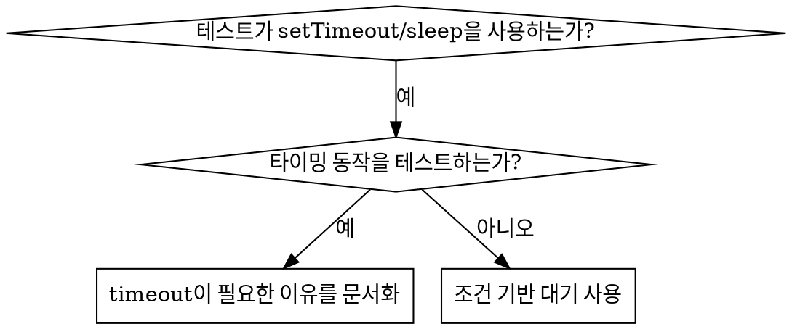

# Condition-Based Waiting

## 개요

flaky test는 종종 임의의 지연으로 timing을 추측합니다. 이는 빠른 머신에서는 test가 통과하지만 부하 상태나 CI에서는 실패하는 race condition을 만듭니다.

**핵심 원칙:** 얼마나 걸릴지에 대한 추측이 아니라, 당신이 관심 있는 실제 condition을 기다리세요.

## 사용 시점



**다음과 같은 경우에 사용하세요:**
- test가 임의의 지연을 가짐 (`setTimeout`, `sleep`, `time.sleep()`)
- test가 flaky함 (때때로 통과, 부하 상태에서 실패)
- 병렬로 실행될 때 test가 timeout됨
- async 작업의 완료를 기다림

**다음과 같은 경우에는 사용하지 마세요:**
- 실제 timing 동작을 테스트할 때 (debounce, throttle 간격)
- 임의의 timeout을 사용한다면 항상 WHY를 문서화하세요

## 핵심 패턴

```typescript
// ❌ BEFORE: Guessing at timing
await new Promise(r => setTimeout(r, 50));
const result = getResult();
expect(result).toBeDefined();

// ✅ AFTER: Waiting for condition
await waitFor(() => getResult() !== undefined);
const result = getResult();
expect(result).toBeDefined();
```

## 빠른 패턴

| 시나리오 | 패턴 |
|----------|---------|
| 이벤트 대기 | `waitFor(() => events.find(e => e.type === 'DONE'))` |
| 상태 대기 | `waitFor(() => machine.state === 'ready')` |
| 카운트 대기 | `waitFor(() => items.length >= 5)` |
| 파일 대기 | `waitFor(() => fs.existsSync(path))` |
| 복합 condition | `waitFor(() => obj.ready && obj.value > 10)` |

## 구현

범용 polling 함수:
```typescript
async function waitFor<T>(
  condition: () => T | undefined | null | false,
  description: string,
  timeoutMs = 5000
): Promise<T> {
  const startTime = Date.now();

  while (true) {
    const result = condition();
    if (result) return result;

    if (Date.now() - startTime > timeoutMs) {
      throw new Error(`Timeout waiting for ${description} after ${timeoutMs}ms`);
    }

    await new Promise(r => setTimeout(r, 10)); // Poll every 10ms
  }
}
```

실제 debugging session에서의 도메인별 helper(`waitForEvent`, `waitForEventCount`, `waitForEventMatch`)를 포함한 완전한 구현은 이 디렉토리의 `condition-based-waiting-example.ts`를 참조하세요.

## 흔한 실수

**❌ 너무 빠른 polling:** `setTimeout(check, 1)` - CPU 낭비
**✅ Fix:** 10ms마다 poll

**❌ timeout 없음:** condition이 충족되지 않으면 영원히 loop
**✅ Fix:** 명확한 에러와 함께 항상 timeout 포함

**❌ stale 데이터:** loop 전에 state 캐싱
**✅ Fix:** 신선한 데이터를 위해 loop 내부에서 getter 호출

## 임의의 Timeout이 옳을 때

```typescript
// Tool ticks every 100ms - need 2 ticks to verify partial output
await waitForEvent(manager, 'TOOL_STARTED'); // First: wait for condition
await new Promise(r => setTimeout(r, 200));   // Then: wait for timed behavior
// 200ms = 2 ticks at 100ms intervals - documented and justified
```

**요구사항:**
1. 먼저 trigger condition을 기다리세요
2. 알려진 timing에 기반 (추측이 아님)
3. WHY를 설명하는 주석

## 실제 영향

debugging session(2025-10-03)에서:
- 3개 파일에 걸친 15개의 flaky test fix
- pass rate: 60% → 100%
- 실행 시간: 40% 빨라짐
- 더 이상 race condition 없음
