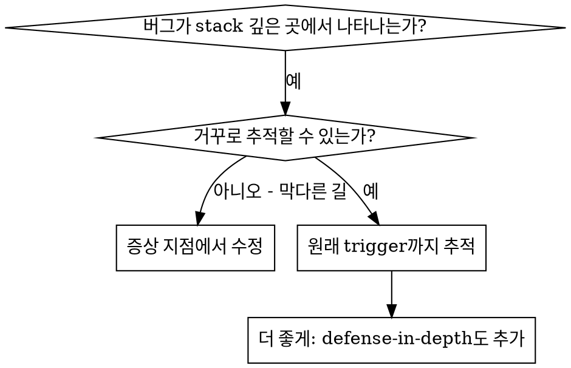
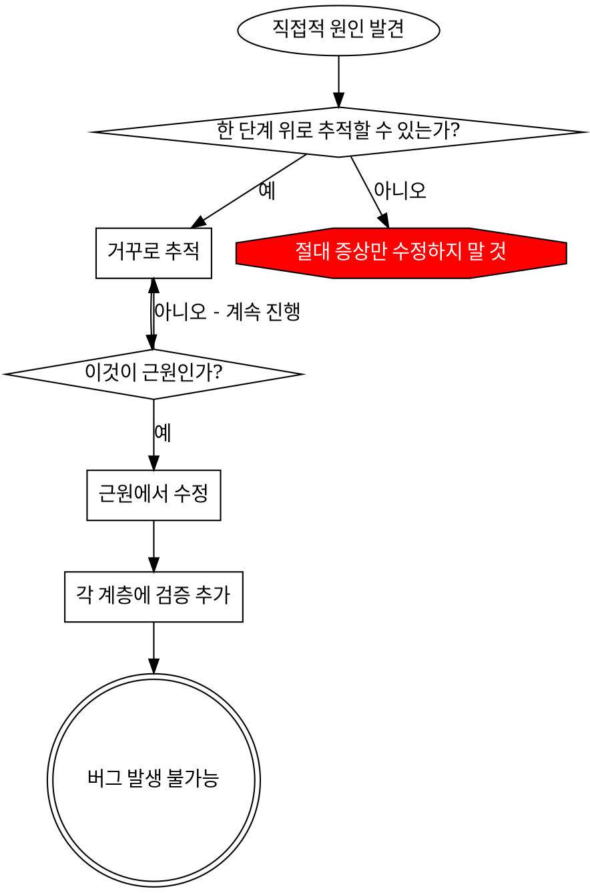

# Root Cause Tracing

## 개요

bug는 종종 call stack 깊은 곳에서 나타납니다 (잘못된 디렉터리에서의 git init, 잘못된 위치에 생성된 파일, 잘못된 경로로 열린 database). 본능적으로 에러가 나타나는 곳을 fix하고 싶지만, 그것은 증상을 다루는 것입니다.

**핵심 원칙:** 원래의 trigger를 찾을 때까지 call chain을 통해 역방향으로 추적한 다음, source에서 fix하세요.

## 사용 시점



**다음과 같은 경우에 사용하세요:**
- 에러가 실행 깊은 곳에서 발생 (진입점이 아님)
- stack trace가 긴 call chain을 보여줌
- 유효하지 않은 데이터가 어디서 시작되었는지 불분명
- 어느 test/code가 문제를 trigger하는지 찾아야 할 때

## Tracing 프로세스

### 1. 증상 관찰
```
Error: git init failed in ~/project/packages/core
```

### 2. 직접적 원인 찾기
**어떤 코드가 직접적으로 이것을 일으키는가?**
```typescript
await execFileAsync('git', ['init'], { cwd: projectDir });
```

### 3. 질문: 이것을 무엇이 호출했는가?
```typescript
WorktreeManager.createSessionWorktree(projectDir, sessionId)
  → called by Session.initializeWorkspace()
  → called by Session.create()
  → called by test at Project.create()
```

### 4. 계속 위로 추적
**어떤 값이 전달되었는가?**
- `projectDir = ''` (빈 문자열!)
- `cwd`로서의 빈 문자열은 `process.cwd()`로 resolve됨
- 그게 소스 코드 디렉터리!

### 5. 원래의 Trigger 찾기
**빈 문자열은 어디서 왔는가?**
```typescript
const context = setupCoreTest(); // Returns { tempDir: '' }
Project.create('name', context.tempDir); // Accessed before beforeEach!
```

## Stack Trace 추가하기

수동으로 추적할 수 없을 때 instrumentation을 추가하세요:

```typescript
// Before the problematic operation
async function gitInit(directory: string) {
  const stack = new Error().stack;
  console.error('DEBUG git init:', {
    directory,
    cwd: process.cwd(),
    nodeEnv: process.env.NODE_ENV,
    stack,
  });

  await execFileAsync('git', ['init'], { cwd: directory });
}
```

**중요:** test에서는 `console.error()`를 사용하세요 (logger는 표시되지 않을 수 있음)

**실행 및 캡처:**
```bash
npm test 2>&1 | grep 'DEBUG git init'
```

**Stack trace 분석:**
- test 파일 이름을 찾으세요
- 호출을 trigger하는 줄 번호를 찾으세요
- 패턴을 식별하세요 (같은 test? 같은 parameter?)

## 어느 Test가 오염을 일으키는지 찾기

test 중에 무언가가 나타나는데 어느 test인지 모를 때:

이 디렉터리의 bisection script `find-polluter.sh`를 사용하세요:

```bash
./find-polluter.sh '.git' 'src/**/*.test.ts'
```

test를 하나씩 실행하고, 첫 번째 polluter에서 멈춥니다. 사용법은 script를 참조하세요.

## 실제 예시: 빈 projectDir

**증상:** `.git`이 `packages/core/`(소스 코드)에 생성됨

**Trace chain:**
1. `git init`이 `process.cwd()`에서 실행됨 ← 빈 cwd parameter
2. WorktreeManager가 빈 projectDir로 호출됨
3. Session.create()가 빈 문자열을 전달함
4. test가 beforeEach 이전에 `context.tempDir`에 접근함
5. setupCoreTest()가 초기에 `{ tempDir: '' }`를 반환함

**Root cause:** 빈 값에 접근하는 최상위 변수 초기화

**Fix:** tempDir을 beforeEach 이전에 접근되면 throw하는 getter로 만듦

**defense-in-depth도 추가:**
- Layer 1: Project.create()가 디렉터리 검증
- Layer 2: WorkspaceManager가 빈 값이 아님을 검증
- Layer 3: NODE_ENV guard가 tmpdir 외부의 git init을 거부
- Layer 4: git init 전 stack trace 로깅

## 핵심 원칙



**에러가 나타나는 곳만 fix하지 마세요.** 원래의 trigger를 찾기 위해 역방향으로 추적하세요.

## Stack Trace 팁

**test에서:** logger가 아닌 `console.error()`를 사용하세요 - logger는 억제될 수 있습니다
**작업 전:** 실패한 후가 아니라 위험한 작업 전에 로그를 남기세요
**맥락 포함:** 디렉터리, cwd, 환경 변수, timestamp
**stack 캡처:** `new Error().stack`은 완전한 call chain을 보여줍니다

## 실제 영향

debugging session(2025-10-03)에서:
- 5단계 추적을 통해 root cause 발견
- source에서 fix (getter 검증)
- 4개 layer의 방어 추가
- 1847개 test 통과, 오염 zero
