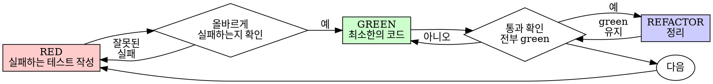

# Test-Driven Development (TDD)

## 개요

test를 먼저 작성합니다. 실패하는 것을 확인합니다. test를 통과시키는 최소한의 코드를 작성합니다.

**핵심 원칙:** test가 실패하는 것을 직접 확인하지 않았다면, 그 test가 올바른 것을 검증하는지 알 수 없습니다.

**규칙의 문구를 위반하는 것은 규칙의 정신을 위반하는 것입니다.**

## 사용 시점

**항상:**
- 새로운 기능
- 버그 수정
- 리팩토링
- 동작 변경

**예외 (human partner에게 문의):**
- 일회용 프로토타입
- 생성된 코드
- 설정 파일

"이번 한 번만 TDD를 건너뛰자"라는 생각이 든다면? 멈추세요. 그것은 합리화입니다.

## 철의 법칙

```
NO PRODUCTION CODE WITHOUT A FAILING TEST FIRST
```

test 전에 코드를 작성했다면? 삭제하세요. 처음부터 다시 시작하세요.

**예외 없음:**
- "참고용"으로 보관하지 마세요
- test를 작성하면서 "적응"시키지 마세요
- 쳐다보지도 마세요
- 삭제는 삭제를 의미합니다

test로부터 새로 implementation 하세요. 끝.

## Red-Green-Refactor



### RED - 실패하는 test 작성

무엇이 일어나야 하는지 보여주는 최소한의 test 하나를 작성합니다.

<Good>
```typescript
test('retries failed operations 3 times', async () => {
  let attempts = 0;
  const operation = () => {
    attempts++;
    if (attempts < 3) throw new Error('fail');
    return 'success';
  };

  const result = await retryOperation(operation);

  expect(result).toBe('success');
  expect(attempts).toBe(3);
});
```
명확한 이름, 실제 동작 test, 한 가지만
</Good>

<Bad>
```typescript
test('retry works', async () => {
  const mock = jest.fn()
    .mockRejectedValueOnce(new Error())
    .mockRejectedValueOnce(new Error())
    .mockResolvedValueOnce('success');
  await retryOperation(mock);
  expect(mock).toHaveBeenCalledTimes(3);
});
```
모호한 이름, 코드가 아닌 mock을 test
</Bad>

**요구사항:**
- 하나의 동작
- 명확한 이름
- 실제 코드 (불가피한 경우가 아니라면 mock 금지)

### RED 검증 - 실패 확인

**필수. 절대 건너뛰지 마세요.**

```bash
npm test path/to/test.test.ts
```

확인 사항:
- test가 실패 (에러가 아님)
- 실패 메시지가 예상대로
- 오타가 아닌, 기능이 없어서 실패

**test가 통과한다면?** 기존 동작을 test 중인 것입니다. test를 수정하세요.

**test가 에러를 낸다면?** 에러를 고치고, 올바르게 실패할 때까지 다시 실행하세요.

### GREEN - 최소 코드

test를 통과시키는 가장 단순한 코드를 작성합니다.

<Good>
```typescript
async function retryOperation<T>(fn: () => Promise<T>): Promise<T> {
  for (let i = 0; i < 3; i++) {
    try {
      return await fn();
    } catch (e) {
      if (i === 2) throw e;
    }
  }
  throw new Error('unreachable');
}
```
딱 통과시킬 만큼만
</Good>

<Bad>
```typescript
async function retryOperation<T>(
  fn: () => Promise<T>,
  options?: {
    maxRetries?: number;
    backoff?: 'linear' | 'exponential';
    onRetry?: (attempt: number) => void;
  }
): Promise<T> {
  // YAGNI
}
```
과도하게 설계됨
</Bad>

기능을 추가하거나, 다른 코드를 리팩토링하거나, test 범위를 넘어 "개선"하지 마세요.

### GREEN 검증 - 통과 확인

**필수.**

```bash
npm test path/to/test.test.ts
```

확인 사항:
- test가 통과
- 다른 test도 여전히 통과
- 출력이 깨끗함 (에러, 경고 없음)

**test가 실패한다면?** test가 아닌 코드를 수정하세요.

**다른 test가 실패한다면?** 지금 고치세요.

### REFACTOR - 정리

green 상태에서만:
- 중복 제거
- 이름 개선
- 헬퍼 추출

test를 green으로 유지하세요. 동작을 추가하지 마세요.

### 반복

다음 기능을 위한 다음 실패 test.

## 좋은 test

| 품질 | Good | Bad |
|---------|------|-----|
| **최소성** | 한 가지만. 이름에 "and"가 있다면? 분리하세요. | `test('validates email and domain and whitespace')` |
| **명확성** | 이름이 동작을 설명 | `test('test1')` |
| **의도 표현** | 원하는 API를 시연 | 코드가 무엇을 해야 하는지 모호하게 함 |

## 순서가 중요한 이유

**"동작하는지 확인하기 위해 나중에 test를 작성하겠다"**

코드 작성 후 작성된 test는 즉시 통과합니다. 즉시 통과한다는 것은 아무것도 증명하지 못합니다:
- 잘못된 것을 test할 수도 있음
- 동작이 아닌 implementation을 test할 수도 있음
- 잊어버린 edge case를 놓칠 수도 있음
- test가 버그를 잡는 것을 본 적이 없음

test-first는 test가 실패하는 것을 보게 하여, 실제로 무언가를 test한다는 것을 증명합니다.

**"이미 모든 edge case를 수동으로 test했다"**

수동 testing은 임시방편입니다. 모든 것을 test했다고 생각하지만:
- test한 내용의 기록이 없음
- 코드가 변경되면 재실행 불가
- 압박 속에서 case를 잊기 쉬움
- "내가 해봤을 때 됐다" ≠ 포괄적

자동화된 test는 체계적입니다. 매번 동일한 방식으로 실행됩니다.

**"X 시간의 작업을 삭제하는 것은 낭비다"**

매몰비용의 오류입니다. 시간은 이미 사라졌습니다. 지금의 선택:
- 삭제하고 TDD로 다시 작성 (X 시간 추가, 높은 확신)
- 유지하고 나중에 test 추가 (30분, 낮은 확신, 버그 가능성 높음)

"낭비"는 신뢰할 수 없는 코드를 유지하는 것입니다. 실제 test 없이 동작하는 코드는 기술 부채입니다.

**"TDD는 교조적이다, 실용적인 것이 적응하는 것이다"**

TDD는 실용적입니다:
- 커밋 전에 버그를 찾음 (나중에 디버깅하는 것보다 빠름)
- 회귀를 방지 (test가 즉시 깨짐을 잡음)
- 동작을 문서화 (test가 코드 사용법을 보여줌)
- 리팩토링을 가능하게 함 (자유롭게 변경, test가 깨짐을 잡음)

"실용적인" 지름길 = 프로덕션에서의 디버깅 = 더 느림.

**"나중 test도 같은 목표를 달성한다 - 정신이지 의식이 아니다"**

아니요. tests-after는 "이게 무엇을 하는가?"에 답합니다. tests-first는 "이게 무엇을 해야 하는가?"에 답합니다.

tests-after는 당신의 implementation에 편향됩니다. 요구되는 것이 아니라 만든 것을 test합니다. 발견된 edge case가 아니라 기억하는 edge case를 검증합니다.

tests-first는 implementation 전에 edge case 발견을 강제합니다. tests-after는 모든 것을 기억했는지 검증합니다 (기억하지 못합니다).

나중에 30분의 test ≠ TDD. coverage는 얻지만, test가 작동한다는 증명을 잃습니다.

## 흔한 합리화

| 핑계 | 현실 |
|--------|---------|
| "test하기에 너무 단순하다" | 단순한 코드도 깨집니다. test는 30초 걸립니다. |
| "나중에 test 하겠다" | 즉시 통과하는 test는 아무것도 증명 못합니다. |
| "나중 test도 같은 목표를 달성" | tests-after = "이게 무엇을 하나?" tests-first = "이게 무엇을 해야 하나?" |
| "이미 수동으로 test했다" | 임시방편 ≠ 체계적. 기록 없음, 재실행 불가. |
| "X 시간을 삭제하는 것은 낭비" | 매몰비용의 오류. 검증되지 않은 코드 유지는 기술 부채. |
| "참고용으로 두고, test부터 작성" | 적응시키게 될 것입니다. 그것이 test-after. 삭제는 삭제. |
| "먼저 탐색이 필요" | 좋습니다. 탐색은 버리고, TDD로 시작하세요. |
| "test가 어렵다 = 설계가 불명확" | test의 말을 들으세요. test하기 어려우면 사용하기도 어렵습니다. |
| "TDD가 나를 느리게 한다" | TDD는 디버깅보다 빠릅니다. 실용적 = test-first. |
| "수동 test가 더 빠름" | 수동은 edge case를 증명 못합니다. 모든 변경마다 다시 test하게 됩니다. |
| "기존 코드는 test가 없다" | 당신이 개선하는 중입니다. 기존 코드에 test를 추가하세요. |

## 위험 신호 - 멈추고 다시 시작

- test 전 코드
- implementation 후 test
- test가 즉시 통과
- test가 왜 실패했는지 설명 못 함
- test를 "나중에" 추가
- "이번 한 번만" 합리화
- "이미 수동으로 test했다"
- "나중 test도 같은 목적 달성"
- "정신이지 의식이 아니다"
- "참고용 보관" 또는 "기존 코드 적응"
- "이미 X 시간 썼다, 삭제는 낭비"
- "TDD는 교조적, 나는 실용적"
- "이건 달라, 왜냐하면..."

**이 모든 것은 의미합니다: 코드를 삭제하세요. TDD로 다시 시작하세요.**

## 예시: 버그 수정

**버그:** 빈 이메일이 허용됨

**RED**
```typescript
test('rejects empty email', async () => {
  const result = await submitForm({ email: '' });
  expect(result.error).toBe('Email required');
});
```

**RED 검증**
```bash
$ npm test
FAIL: expected 'Email required', got undefined
```

**GREEN**
```typescript
function submitForm(data: FormData) {
  if (!data.email?.trim()) {
    return { error: 'Email required' };
  }
  // ...
}
```

**GREEN 검증**
```bash
$ npm test
PASS
```

**REFACTOR**
필요하다면 여러 필드에 대한 validation을 추출합니다.

## 검증 체크리스트

작업 완료를 표시하기 전:

- [ ] 모든 새로운 함수/메서드에 test가 있음
- [ ] implementation 전에 각 test가 실패하는 것을 확인함
- [ ] 각 test가 예상된 이유로 실패함 (오타가 아닌 기능 부재)
- [ ] 각 test를 통과시키는 최소 코드를 작성함
- [ ] 모든 test가 통과
- [ ] 출력이 깨끗함 (에러, 경고 없음)
- [ ] test가 실제 코드를 사용함 (불가피한 경우만 mock)
- [ ] Edge case와 에러가 다뤄짐

모든 체크박스를 표시할 수 없다면? TDD를 건너뛴 것입니다. 다시 시작하세요.

## 막혔을 때

| 문제 | 해결 |
|---------|----------|
| test 작성법을 모름 | 원하는 API를 작성하세요. assertion부터 작성하세요. human partner에게 문의하세요. |
| test가 너무 복잡 | 설계가 너무 복잡합니다. 인터페이스를 단순화하세요. |
| 모든 것을 mock해야 함 | 코드가 너무 결합됨. 의존성 주입을 사용하세요. |
| test setup이 큼 | 헬퍼를 추출하세요. 여전히 복잡? 설계를 단순화하세요. |

## 디버깅 통합

버그를 발견했다면? 재현하는 실패 test를 작성하세요. TDD 사이클을 따르세요. test가 수정을 증명하고 회귀를 방지합니다.

test 없이 버그를 절대 고치지 마세요.

## Testing Anti-Patterns

mock이나 test 유틸리티를 추가할 때, 흔한 함정을 피하기 위해 @testing-anti-patterns.md를 읽으세요:
- 실제 동작 대신 mock 동작을 test
- production 클래스에 test 전용 메서드 추가
- 의존성을 이해하지 않고 mock

## 최종 규칙

```
Production 코드 → test가 존재하고 먼저 실패했다
그 외 → TDD가 아니다
```

human partner의 허가 없이는 예외 없음.
