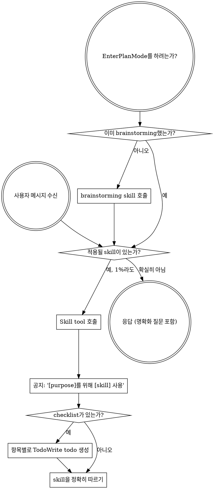

<SUBAGENT-STOP>
특정 작업을 수행하기 위해 subagent로 dispatch되었다면, 이 skill은 건너뛰세요.
</SUBAGENT-STOP>

<EXTREMELY-IMPORTANT>
지금 하고 있는 일에 어떤 skill이 적용될 가능성이 1%라도 있다고 생각된다면, 반드시 그 skill을 호출해야 합니다.

skill이 작업에 적용된다면, 선택의 여지는 없습니다. 반드시 사용해야 합니다.

이것은 협상의 여지가 없습니다. 선택사항이 아닙니다. 어떠한 합리화로도 빠져나갈 수 없습니다.
</EXTREMELY-IMPORTANT>

## 지시 우선순위

Superpowers skill은 기본 시스템 prompt 동작을 override하지만, **사용자 지시가 항상 우선합니다**:

1. **사용자의 명시적 지시** (CLAUDE.md, GEMINI.md, AGENTS.md, 직접 요청) — 최우선
2. **Superpowers skill** — 충돌하는 경우 기본 시스템 동작을 override
3. **기본 시스템 prompt** — 최하위

CLAUDE.md, GEMINI.md, AGENTS.md에서 "TDD를 사용하지 마라"고 하고 skill에서 "항상 TDD를 사용하라"고 하면, 사용자 지시를 따르세요. 사용자가 통제권을 갖습니다.

## skill에 접근하는 방법

**Claude Code에서:** `Skill` tool을 사용하세요. skill을 호출하면 해당 내용이 로드되어 제공됩니다 — 그것을 직접 따르세요. skill 파일에 Read tool을 사용하지 마세요.

**Copilot CLI에서:** `skill` tool을 사용하세요. skill은 설치된 plugin에서 자동으로 발견됩니다. `skill` tool은 Claude Code의 `Skill` tool과 동일하게 작동합니다.

**Gemini CLI에서:** skill은 `activate_skill` tool을 통해 활성화됩니다. Gemini는 session 시작 시 skill 메타데이터를 로드하고 필요할 때 전체 내용을 활성화합니다.

**다른 환경에서:** skill이 어떻게 로드되는지에 대해서는 해당 플랫폼의 문서를 확인하세요.

## 플랫폼 적응

skill은 Claude Code tool 이름을 사용합니다. Non-CC 플랫폼: tool 대응표는 `references/copilot-tools.md` (Copilot CLI), `references/codex-tools.md` (Codex)를 참조하세요. Gemini CLI 사용자는 GEMINI.md를 통해 tool 매핑이 자동으로 로드됩니다.

# skill 사용하기

## 규칙

**응답이나 행동을 하기 전에 관련된 또는 요청된 skill을 호출하세요.** skill이 적용될 가능성이 1%라도 있다면 skill을 호출해서 확인해야 합니다. 호출한 skill이 상황에 맞지 않는 것으로 판명되면, 사용하지 않아도 됩니다.

## 위험 신호

이런 생각이 들면 멈추세요 — 합리화하고 있는 것입니다:

| 생각 | 실제 |
|---------|---------|
| "이건 그냥 간단한 질문이야" | 질문도 작업입니다. skill을 확인하세요. |
| "먼저 context가 더 필요해" | skill 확인이 명확화 질문보다 먼저입니다. |
| "먼저 codebase를 탐색해보자" | skill이 탐색 방법을 알려줍니다. 먼저 확인하세요. |
| "git/파일을 빠르게 확인할 수 있어" | 파일에는 대화 context가 없습니다. skill을 확인하세요. |
| "먼저 정보를 모아보자" | skill이 정보 수집 방법을 알려줍니다. |
| "이건 정식 skill이 필요 없어" | skill이 존재한다면, 사용하세요. |
| "이 skill 기억해" | skill은 진화합니다. 현재 버전을 읽으세요. |
| "이건 작업으로 치지 않아" | 행동 = 작업. skill을 확인하세요. |
| "이 skill은 과해" | 간단한 일이 복잡해집니다. 사용하세요. |
| "이거 하나만 먼저 할게" | 어떤 일이든 하기 전에 확인하세요. |
| "이게 생산적으로 느껴져" | 규율 없는 행동은 시간을 낭비합니다. skill이 이를 방지합니다. |
| "그게 무슨 뜻인지 알아" | 개념을 안다는 것 ≠ skill을 사용하는 것. 호출하세요. |

## skill 우선순위

여러 skill이 적용될 수 있을 때는, 이 순서로 사용하세요:

1. **프로세스 skill 먼저** (brainstorming, debugging) - 작업에 접근하는 방법을 결정합니다
2. **구현 skill 다음** (frontend-design, mcp-builder) - 실행을 안내합니다

"X를 만들자" → brainstorming 먼저, 그 다음 구현 skill.
"이 버그를 고쳐" → debugging 먼저, 그 다음 도메인별 skill.

## skill 유형

**Rigid** (TDD, debugging): 정확히 따르세요. 규율을 적당히 조정해서 빠져나가지 마세요.

**Flexible** (패턴): 원칙을 context에 맞게 적용하세요.

skill 자체가 어떤 유형인지 알려줍니다.

## 사용자 지시

지시는 무엇을 할지(WHAT)이지, 어떻게(HOW)가 아닙니다. "X를 추가해" 또는 "Y를 고쳐"는 workflow를 건너뛰라는 의미가 아닙니다.
