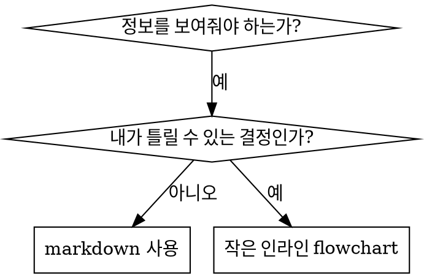

# Writing Skills

## 개요

**skill을 작성한다는 것은 프로세스 문서에 적용된 Test-Driven Development입니다.**

**개인용 skill은 agent별 디렉터리에 위치합니다 (Claude Code는 `~/.claude/skills`, Codex는 `~/.agents/skills/`)**

테스트 케이스(subagent를 활용한 압박 시나리오)를 작성하고, 그것이 실패하는 모습(베이스라인 동작)을 관찰하고, skill(문서)을 작성하고, 테스트가 통과하는 모습(agent가 따름)을 관찰하고, 리팩터링(허점 차단)합니다.

**핵심 원칙:** skill 없이 agent가 실패하는 것을 관찰하지 않았다면, skill이 올바른 것을 가르치는지 알 수 없습니다.

**필수 사전 지식:** 이 skill을 사용하기 전에 반드시 suberpower:test-driven-development를 이해해야 합니다. 그 skill이 근본적인 RED-GREEN-REFACTOR 사이클을 정의합니다. 이 skill은 TDD를 문서 작성에 적용합니다.

**공식 가이드:** Anthropic의 공식 skill 작성 베스트 프랙티스는 anthropic-best-practices.md를 참고하세요. 이 문서는 이 skill의 TDD 중심 접근 방식을 보완하는 추가 패턴과 가이드라인을 제공합니다.

## skill이란 무엇인가?

**skill**은 검증된 기법, 패턴, 도구에 대한 참조 가이드입니다. skill은 미래의 Claude 인스턴스가 효과적인 접근법을 찾아 적용할 수 있도록 돕습니다.

**skill에 해당하는 것:** 재사용 가능한 기법, 패턴, 도구, 참조 가이드

**skill에 해당하지 않는 것:** 한 번 문제를 어떻게 해결했는지에 대한 서사

## skill을 위한 TDD 매핑

| TDD 개념 | Skill 작성 |
|-------------|----------------|
| **테스트 케이스** | subagent를 활용한 압박 시나리오 |
| **프로덕션 코드** | skill 문서 (SKILL.md) |
| **테스트 실패 (RED)** | skill 없이 agent가 규칙을 위반함 (베이스라인) |
| **테스트 통과 (GREEN)** | skill이 있을 때 agent가 따름 |
| **리팩터링** | 따름을 유지한 채 허점을 차단 |
| **테스트 먼저 작성** | skill 작성 전에 베이스라인 시나리오 실행 |
| **실패 관찰** | agent가 사용하는 정확한 합리화를 기록 |
| **최소한의 코드** | 해당 위반에 정확히 대응하는 skill 작성 |
| **통과 관찰** | agent가 이제 따르는지 검증 |
| **리팩터 사이클** | 새로운 합리화 발견 → 차단 → 재검증 |

skill 작성 전체 프로세스는 RED-GREEN-REFACTOR를 따릅니다.

## 언제 skill을 만들어야 하는가

**만들어야 할 때:**
- 그 기법이 직관적으로 명백하지 않았던 경우
- 여러 프로젝트에서 다시 참조할 가능성이 있는 경우
- 패턴이 광범위하게 적용되는 경우 (프로젝트 특화가 아님)
- 다른 사람들에게도 도움이 될 경우

**만들지 말아야 할 때:**
- 일회성 해결책
- 다른 곳에 잘 문서화된 표준 관행
- 프로젝트 고유 규칙 (CLAUDE.md에 작성)
- 기계적인 제약 (regex/validation으로 강제 가능하다면 자동화하세요. 문서는 판단이 필요한 사안을 위해 남겨두세요)

## skill 유형

### Technique
따라야 할 단계가 있는 구체적인 방법 (condition-based-waiting, root-cause-tracing)

### Pattern
문제를 바라보는 사고 방식 (flatten-with-flags, test-invariants)

### Reference
API 문서, 문법 가이드, 도구 문서 (office docs)

## 디렉터리 구조


```
skills/
  skill-name/
    SKILL.md              # 메인 참조 (필수)
    supporting-file.*     # 필요한 경우에만
```

**플랫 네임스페이스** - 모든 skill은 하나의 검색 가능한 네임스페이스에 위치합니다

**별도 파일이 필요한 경우:**
1. **분량이 큰 참조 자료** (100줄 이상) - API 문서, 포괄적 문법
2. **재사용 가능한 도구** - 스크립트, 유틸리티, 템플릿

**인라인으로 유지:**
- 원칙과 개념
- 코드 패턴 (50줄 미만)
- 그 외 모든 것

## SKILL.md 구조

**Frontmatter (YAML):**
- 필수 필드 두 개: `name`과 `description` (모든 지원 필드는 [agentskills.io/specification](https://agentskills.io/specification) 참고)
- 전체 길이 최대 1024자
- `name`: 영문자, 숫자, 하이픈만 사용 (괄호, 특수문자 금지)
- `description`: 3인칭으로, **언제** 사용하는지만 설명 (무엇을 하는지가 아님)
  - "...할 때 사용합니다"로 끝맺어 트리거 조건에 집중
  - 구체적 증상, 상황, 맥락 포함
  - **skill의 프로세스나 워크플로우를 절대 요약하지 말 것** (이유는 CSO 섹션 참고)
  - 가능하면 500자 이내로 유지

```markdown
---
name: Skill-Name-With-Hyphens
description: [구체적인 트리거 조건과 증상]일 때 사용합니다
---

# Skill Name

## Overview
이게 무엇인가? 핵심 원칙을 1~2문장으로.

## When to Use
[결정이 자명하지 않을 때 작은 인라인 flowchart]

증상과 사용 사례 불릿 목록
사용하지 말아야 할 때

## Core Pattern (technique/pattern 용)
Before/after 코드 비교

## Quick Reference
일반 작업을 빠르게 훑기 위한 표나 불릿

## Implementation
단순한 패턴은 인라인 코드
분량이 큰 참조나 재사용 가능한 도구는 파일 링크

## Common Mistakes
무엇이 잘못되는지 + 해결법

## Real-World Impact (선택)
구체적 결과
```


## Claude Search Optimization (CSO)

**발견을 위한 핵심:** 미래의 Claude가 당신의 skill을 찾을 수 있어야 합니다

### 1. 풍부한 description 필드

**목적:** Claude는 주어진 작업에 어떤 skill을 로드할지 결정하기 위해 description을 읽습니다. "지금 이 skill을 읽어야 하는가?"에 답이 되도록 만드세요.

**형식:** "...할 때 사용합니다"로 끝맺어 트리거 조건에 집중

**중요: Description은 언제 사용하는지이지, skill이 무엇을 하는지가 아닙니다**

description은 트리거 조건만 설명해야 합니다. skill의 프로세스나 워크플로우를 description에 요약하지 마세요.

**왜 중요한가:** 테스트 결과, description이 skill의 워크플로우를 요약하면 Claude가 skill의 전체 내용을 읽는 대신 description을 따르는 경향이 나타났습니다. "task 사이에 code review"라고 적힌 description은 Claude가 단 한 번의 리뷰만 수행하게 만들었습니다. skill의 flowchart는 두 번의 리뷰(spec compliance 후 code quality)를 명확히 보여주었음에도 말입니다.

description을 단순히 "독립적인 task로 구성된 implementation plan을 실행할 때 사용합니다"(워크플로우 요약 없음)로 바꾸자 Claude는 flowchart를 올바르게 읽고 2단계 리뷰 프로세스를 따랐습니다.

**함정:** 워크플로우를 요약하는 description은 Claude가 따라가는 지름길을 만들어냅니다. skill 본문은 Claude가 건너뛰는 문서가 되어버립니다.

```yaml
# ❌ BAD: 워크플로우 요약 - Claude가 skill을 읽는 대신 이것을 따를 수 있음
description: plan 실행 시 사용 - task마다 subagent를 dispatch하고 task 사이에 code review 수행

# ❌ BAD: 너무 많은 프로세스 디테일
description: TDD용 - test를 먼저 작성하고, 실패를 확인하고, 최소한의 코드를 작성하고, 리팩터링

# ✅ GOOD: 트리거 조건만, 워크플로우 요약 없음
description: 현재 세션에서 독립적인 task로 구성된 implementation plan을 실행할 때 사용합니다

# ✅ GOOD: 트리거 조건만
description: 모든 기능 구현이나 버그 수정 시 implementation 코드를 작성하기 전에 사용합니다
```

**내용:**
- 이 skill이 적용된다는 신호가 되는 구체적 트리거, 증상, 상황 사용
- *문제*를 설명 (race condition, 일관성 없는 동작) — *언어별 증상*이 아님 (setTimeout, sleep)
- skill 자체가 특정 기술에 종속되지 않는 한 트리거를 기술 중립적으로 유지
- skill이 기술 종속적이라면 트리거에 명시
- 3인칭으로 작성 (시스템 prompt에 주입됨)
- **skill의 프로세스나 워크플로우를 절대 요약하지 말 것**

```yaml
# ❌ BAD: 너무 추상적, 모호함, 언제 사용하는지가 빠짐
description: 비동기 테스팅용

# ❌ BAD: 1인칭
description: 테스트가 불안정할 때 제가 async 테스트를 도와드릴 수 있습니다

# ❌ BAD: 기술을 언급했지만 skill이 그 기술 전용이 아님
description: test가 setTimeout/sleep을 사용하고 불안정할 때 사용합니다

# ✅ GOOD: 트리거 조건으로 끝맺음, 문제를 설명, 워크플로우 없음
description: test에 race condition이나 타이밍 의존성이 있거나, 통과/실패가 일관되지 않을 때 사용합니다

# ✅ GOOD: 기술 종속 skill에 명시적 트리거
description: React Router를 사용하며 인증 리다이렉트를 다룰 때 사용합니다
```

### 2. 키워드 커버리지

Claude가 검색할 만한 단어들을 사용:
- 에러 메시지: "Hook timed out", "ENOTEMPTY", "race condition"
- 증상: "flaky", "hanging", "zombie", "pollution"
- 동의어: "timeout/hang/freeze", "cleanup/teardown/afterEach"
- 도구: 실제 명령어, 라이브러리 이름, 파일 타입

### 3. 서술적 네이밍

**능동태, 동사 우선 사용:**
- ✅ `creating-skills` (X: `skill-creation`)
- ✅ `condition-based-waiting` (X: `async-test-helpers`)

### 4. 토큰 효율성 (중요)

**문제:** getting-started와 자주 참조되는 skill들은 모든 대화에 로드됩니다. 모든 토큰이 중요합니다.

**목표 단어 수:**
- getting-started 워크플로우: 각각 150단어 미만
- 자주 로드되는 skill: 전체 200단어 미만
- 그 외 skill: 500단어 미만 (그래도 간결하게)

**기법:**

**디테일은 도구 help로 옮기기:**
```bash
# ❌ BAD: 모든 플래그를 SKILL.md에 기록
search-conversations는 --text, --both, --after DATE, --before DATE, --limit N을 지원합니다

# ✅ GOOD: --help 참조
search-conversations는 여러 모드와 필터를 지원합니다. 자세한 내용은 --help를 실행하세요.
```

**상호 참조 사용:**
```markdown
# ❌ BAD: 워크플로우 디테일 반복
검색할 때는 템플릿과 함께 subagent를 dispatch하고...
[반복된 지시 20줄]

# ✅ GOOD: 다른 skill 참조
항상 subagent를 사용하세요 (context 50-100배 절감). REQUIRED: workflow는 [other-skill-name]을 사용하세요.
```

**예시 압축:**
```markdown
# ❌ BAD: 장황한 예시 (42단어)
your human partner: "예전에 React Router에서 인증 에러를 어떻게 처리했었죠?"
You: React Router 인증 패턴에 대해 과거 대화를 검색하겠습니다.
[검색어와 함께 subagent dispatch: "React Router authentication error handling 401"]

# ✅ GOOD: 최소화된 예시 (20단어)
Partner: "React Router에서 인증 에러를 어떻게 처리했죠?"
You: 검색 중입니다...
[subagent dispatch → 종합]
```

**중복 제거:**
- 상호 참조된 skill에 있는 내용 반복 금지
- 명령어로 자명한 것을 설명하지 말 것
- 같은 패턴의 여러 예시를 포함하지 말 것

**검증:**
```bash
wc -w skills/path/SKILL.md
# getting-started 워크플로우: 각각 150 미만 목표
# 그 외 자주 로드되는 것: 전체 200 미만 목표
```

**무엇을 DO하는지 또는 핵심 통찰로 명명:**
- ✅ `condition-based-waiting` > `async-test-helpers`
- ✅ `using-skills` (X: `skill-usage`)
- ✅ `flatten-with-flags` > `data-structure-refactoring`
- ✅ `root-cause-tracing` > `debugging-techniques`

**Gerund(-ing)는 프로세스에 적합:**
- `creating-skills`, `testing-skills`, `debugging-with-logs`
- 능동적, 당신이 취하는 동작을 묘사

### 4. 다른 skill 상호 참조

**다른 skill을 참조하는 문서를 작성할 때:**

skill 이름만 사용하고, 명시적 요구 표시를 함께 적습니다:
- ✅ Good: `**REQUIRED SUB-SKILL:** Use suberpower:test-driven-development`
- ✅ Good: `**REQUIRED BACKGROUND:** You MUST understand suberpower:systematic-debugging`
- ❌ Bad: `See skills/testing/test-driven-development` (필수인지 불분명)
- ❌ Bad: `@skills/testing/test-driven-development/SKILL.md` (강제 로드, context 소모)

**왜 @ 링크를 쓰지 않는가:** `@` 문법은 파일을 즉시 강제 로드해, 필요하기도 전에 200k+ context를 소비합니다.

## Flowchart 사용



**flowchart는 다음 경우에만 사용:**
- 자명하지 않은 결정 지점
- 너무 일찍 멈출 수 있는 프로세스 루프
- "A vs B 언제 사용" 결정

**flowchart를 절대 사용하지 말 것:**
- 참조 자료 → 표, 목록
- 코드 예제 → 마크다운 블록
- 선형 지시 → 번호 목록
- 의미 없는 라벨 (step1, helper2)

graphviz 스타일 규칙은 @graphviz-conventions.dot를 참고하세요.

**사람 파트너에게 시각화:** 이 디렉터리의 `render-graphs.js`로 skill의 flowchart를 SVG로 렌더링할 수 있습니다:
```bash
./render-graphs.js ../some-skill           # 각 다이어그램을 따로
./render-graphs.js ../some-skill --combine # 모든 다이어그램을 하나의 SVG로
```

## 코드 예시

**훌륭한 예시 하나가 평범한 여러 개를 이깁니다**

가장 관련성 높은 언어를 선택:
- 테스팅 기법 → TypeScript/JavaScript
- 시스템 디버깅 → Shell/Python
- 데이터 처리 → Python

**좋은 예시:**
- 완전하고 실행 가능
- WHY를 설명하는 주석
- 실제 시나리오 기반
- 패턴을 명확히 보여줌
- 적용 준비 완료 (일반 템플릿이 아님)

**하지 말 것:**
- 5개 이상 언어로 구현
- 빈칸 채우기 템플릿 생성
- 억지 예시 작성

당신은 포팅에 능숙합니다 - 훌륭한 예시 하나면 충분합니다.

## 파일 구성

### 자족적인 skill
```
defense-in-depth/
  SKILL.md    # 모든 것이 인라인
```
언제: 모든 내용이 들어맞고, 분량이 큰 참조가 필요 없을 때

### 재사용 가능한 도구가 있는 skill
```
condition-based-waiting/
  SKILL.md    # 개요 + 패턴
  example.ts  # 적용 가능한 동작하는 헬퍼
```
언제: 도구가 단순 서사가 아니라 재사용 가능한 코드일 때

### 분량이 큰 참조가 있는 skill
```
pptx/
  SKILL.md       # 개요 + 워크플로우
  pptxgenjs.md   # 600줄 API 참조
  ooxml.md       # 500줄 XML 구조
  scripts/       # 실행 가능한 도구
```
언제: 참조 자료가 인라인으로 두기에는 너무 클 때

## Iron Law (TDD와 동일)

```
NO SKILL WITHOUT A FAILING TEST FIRST
```

이는 새 skill과 기존 skill의 편집 모두에 적용됩니다.

테스트 전에 skill을 작성했나요? 삭제하세요. 다시 시작하세요.
테스트 없이 skill을 편집했나요? 같은 위반입니다.

**예외 없음:**
- "간단한 추가"라고 해서가 아닙니다
- "그냥 섹션 추가"라고 해서가 아닙니다
- "문서 업데이트"라고 해서가 아닙니다
- 테스트하지 않은 변경을 "참고용"이라며 남기지 말 것
- 테스트를 실행하면서 "적응"하지 말 것
- 삭제는 삭제를 의미합니다

**필수 사전 지식:** suberpower:test-driven-development skill이 왜 이것이 중요한지 설명합니다. 같은 원칙이 문서에도 적용됩니다.

## 모든 skill 유형 테스트

서로 다른 skill 유형은 서로 다른 테스트 접근이 필요합니다:

### 규율 강제 skill (rule/requirement)

**예시:** TDD, verification-before-completion, designing-before-coding

**테스트 방법:**
- 학술적 질문: 규칙을 이해하고 있는가?
- 압박 시나리오: 스트레스 상황에서도 따르는가?
- 여러 압박 결합: 시간 + 매몰비용 + 피로
- 합리화를 식별하고 명시적 반론을 추가

**성공 기준:** 최대 압박 하에서도 agent가 규칙을 따름

### 기법 skill (how-to 가이드)

**예시:** condition-based-waiting, root-cause-tracing, defensive-programming

**테스트 방법:**
- 적용 시나리오: 기법을 올바르게 적용할 수 있는가?
- 변형 시나리오: 엣지 케이스를 다룰 수 있는가?
- 정보 부족 테스트: 지시에 빈틈이 있는가?

**성공 기준:** agent가 새로운 시나리오에 기법을 성공적으로 적용

### 패턴 skill (멘탈 모델)

**예시:** reducing-complexity, information-hiding 개념

**테스트 방법:**
- 인식 시나리오: 패턴이 적용되는 상황을 인식하는가?
- 적용 시나리오: 멘탈 모델을 사용할 수 있는가?
- 반례: 적용하지 말아야 할 때를 아는가?

**성공 기준:** agent가 언제/어떻게 패턴을 적용할지 올바르게 식별

### 참조 skill (문서/API)

**예시:** API 문서, 명령어 참조, 라이브러리 가이드

**테스트 방법:**
- 검색 시나리오: 올바른 정보를 찾을 수 있는가?
- 적용 시나리오: 찾은 것을 올바르게 사용할 수 있는가?
- 빈틈 테스트: 일반적인 사용 사례가 다뤄지는가?

**성공 기준:** agent가 참조 정보를 찾아 올바르게 적용

## 테스트를 건너뛰는 흔한 합리화

| 핑계 | 현실 |
|--------|---------|
| "skill이 명백히 명확하다" | 당신에게 명확한 것 ≠ 다른 agent에게 명확함. 테스트하세요. |
| "그냥 참고용이다" | 참조도 빈틈, 불명확한 섹션이 있을 수 있다. 검색을 테스트하세요. |
| "테스팅은 과하다" | 테스트되지 않은 skill에는 항상 문제가 있다. 15분 테스트가 몇 시간을 아낀다. |
| "문제가 나타나면 테스트하겠다" | 문제 = agent가 skill을 못 쓰는 상태. 배포 전에 테스트하라. |
| "테스트가 너무 귀찮다" | 테스트가 프로덕션에서 잘못된 skill 디버깅보다 덜 귀찮다. |
| "잘 됐다고 확신한다" | 과신은 문제를 보장한다. 어쨌든 테스트하라. |
| "학술적 리뷰면 충분하다" | 읽기 ≠ 사용. 적용 시나리오를 테스트하라. |
| "테스트할 시간이 없다" | 테스트되지 않은 skill 배포는 나중에 고치는 데 더 많은 시간을 쓰게 한다. |

**이 모든 것은: 배포 전에 테스트하라. 예외 없음.**

## 합리화에 대비한 skill 방탄화

규율을 강제하는 skill(예: TDD)은 합리화에 저항해야 합니다. agent는 영리하고, 압박을 받으면 허점을 찾아냅니다.

**심리학 참고:** persuasion 기법이 왜 작동하는지 이해하면 체계적으로 적용할 수 있습니다. authority, commitment, scarcity, social proof, unity 원칙의 연구 기반(Cialdini, 2021; Meincke et al., 2025)은 persuasion-principles.md를 참고하세요.

### 모든 허점을 명시적으로 차단

규칙을 진술하는 데서 그치지 말고, 구체적인 우회를 금지하세요:

<Bad>
```markdown
test보다 코드를 먼저 작성했나요? 삭제하세요.
```
</Bad>

<Good>
```markdown
test보다 코드를 먼저 작성했나요? 삭제하세요. 처음부터 다시 시작하세요.

**예외 없음:**
- "참고용"으로 남겨두지 말 것
- test를 작성하면서 그것을 "각색"하지 말 것
- 쳐다보지도 말 것
- 삭제하라는 것은 삭제하라는 뜻
```
</Good>

### "정신 vs 글자" 논쟁에 대응

근본 원칙을 일찍 추가:

```markdown
**규칙의 문구를 어기는 것이 곧 규칙의 취지를 어기는 것입니다.**
```

이것은 "나는 정신을 따르고 있다" 류의 합리화 전체를 차단합니다.

### 합리화 표 구축

베이스라인 테스트에서 합리화를 수집합니다 (아래 Testing 섹션 참고). agent가 하는 모든 핑계가 표에 들어갑니다:

```markdown
| 핑계 | 현실 |
|--------|---------|
| "테스트하기엔 너무 단순하다" | 단순한 코드도 깨집니다. 테스트는 30초면 됩니다. |
| "나중에 테스트하겠다" | 바로 통과하는 테스트는 아무것도 증명하지 못합니다. |
| "나중에 테스트해도 같은 목표를 달성한다" | 사후 테스트 = "이게 뭘 하는 거지?" 선행 테스트 = "이게 뭘 해야 하지?" |
```

### Red Flags 목록 작성

agent가 합리화하고 있을 때 스스로 체크하기 쉽게 만듭니다:

```markdown
## Red Flags - STOP and Start Over

- test보다 코드가 먼저
- "이미 수동으로 테스트했잖아요"
- "나중에 테스트해도 같은 목적을 달성합니다"
- "형식이 아니라 취지가 중요합니다"
- "이 경우는 다릅니다. 왜냐하면..."

**이 모든 것이 의미하는 바: 코드를 삭제하라. TDD로 처음부터 다시 시작하라.**
```

### 위반 증상에 맞춰 CSO 업데이트

description에 추가: 규칙을 위반하기 직전의 증상:

```yaml
description: 모든 기능 구현이나 버그 수정 시 implementation 코드를 작성하기 전에 사용합니다
```

## skill을 위한 RED-GREEN-REFACTOR

TDD 사이클을 따릅니다:

### RED: 실패하는 테스트 작성 (베이스라인)

skill 없이 subagent로 압박 시나리오를 실행하세요. 정확한 동작을 기록:
- 어떤 선택을 했는가?
- 어떤 합리화를 사용했는가 (그대로)?
- 어떤 압박이 위반을 유발했는가?

이것이 "테스트가 실패하는 모습을 본다"입니다. skill을 작성하기 전에 agent가 자연스럽게 무엇을 하는지 봐야 합니다.

### GREEN: 최소한의 skill 작성

그 특정 합리화에 대응하는 skill을 작성합니다. 가상의 상황을 위한 추가 내용을 넣지 마세요.

같은 시나리오를 skill과 함께 실행합니다. agent가 이제 따라야 합니다.

### REFACTOR: 허점 차단

agent가 새 합리화를 발견했나요? 명시적 반론을 추가합니다. 방탄이 될 때까지 재테스트합니다.

**테스팅 방법론:** 완전한 테스팅 방법론은 @testing-skills-with-subagents.md를 참고하세요:
- 압박 시나리오 작성 방법
- 압박 유형 (시간, 매몰비용, 권위, 피로)
- 체계적으로 구멍 막기
- 메타 테스팅 기법

## 안티 패턴

### ❌ 서사형 예시
"2025-10-03 세션에서 빈 projectDir가 원인이라는 것을 발견했고..."
**왜 나쁜가:** 너무 구체적, 재사용 불가

### ❌ 다중 언어 희석
example-js.js, example-py.py, example-go.go
**왜 나쁜가:** 평범한 품질, 유지보수 부담

### ❌ flowchart 안의 코드
```dot
step1 [label="import fs"];
step2 [label="read file"];
```
**왜 나쁜가:** 복사-붙여넣기 불가, 읽기 어려움

### ❌ 일반적인 라벨
helper1, helper2, step3, pattern4
**왜 나쁜가:** 라벨은 의미를 가져야 함

## STOP: 다음 skill로 넘어가기 전에

**어떤 skill을 작성했든, 반드시 멈추고 배포 프로세스를 완료해야 합니다.**

**하지 말 것:**
- 각각을 테스트하지 않은 채 여러 skill을 일괄로 만들기
- 현재 skill이 검증되기 전에 다음 skill로 이동
- "일괄 처리가 더 효율적"이라며 테스트 건너뛰기

**아래 배포 체크리스트는 각 skill마다 필수입니다.**

테스트되지 않은 skill을 배포 = 테스트되지 않은 코드 배포. 품질 기준 위반입니다.

## skill 작성 체크리스트 (TDD 적용)

**중요: 아래 각 체크리스트 항목에 대해 TodoWrite로 todo를 생성하세요.**

**RED 단계 - 실패하는 테스트 작성:**
- [ ] 압박 시나리오 작성 (규율 skill은 3+ 결합 압박)
- [ ] skill 없이 시나리오 실행 - 베이스라인 동작을 그대로 기록
- [ ] 합리화/실패의 패턴 식별

**GREEN 단계 - 최소한의 skill 작성:**
- [ ] 이름이 영문자, 숫자, 하이픈만 사용 (괄호/특수문자 없음)
- [ ] 필수 `name`과 `description` 필드를 가진 YAML frontmatter (최대 1024자; [spec](https://agentskills.io/specification) 참고)
- [ ] description이 "...할 때 사용합니다"로 끝나고 구체적 트리거/증상 포함
- [ ] description을 3인칭으로 작성
- [ ] 검색을 위해 키워드를 전반에 분포 (에러, 증상, 도구)
- [ ] 핵심 원칙이 있는 명료한 개요
- [ ] RED에서 식별된 구체적 베이스라인 실패에 대응
- [ ] 인라인 코드 또는 별도 파일 링크
- [ ] 훌륭한 예시 하나 (다중 언어 아님)
- [ ] skill과 함께 시나리오 실행 - agent가 이제 따르는지 검증

**REFACTOR 단계 - 허점 차단:**
- [ ] 테스트에서 새로운 합리화 식별
- [ ] 명시적 반론 추가 (규율 skill인 경우)
- [ ] 모든 테스트 반복에서 합리화 표 구축
- [ ] red flags 목록 작성
- [ ] 방탄이 될 때까지 재테스트

**품질 점검:**
- [ ] 결정이 자명하지 않은 경우에만 작은 flowchart
- [ ] 빠른 참조 표
- [ ] 흔한 실수 섹션
- [ ] 서사형 스토리텔링 없음
- [ ] 지원 파일은 도구나 분량이 큰 참조용으로만

**배포:**
- [ ] skill을 git에 커밋하고 (설정된 경우) 포크에 푸시
- [ ] (광범위하게 유용하면) PR로 기여 고려

## 발견 워크플로우

미래의 Claude가 당신의 skill을 어떻게 찾는지:

1. **문제 발생** ("tests are flaky")
3. **SKILL 발견** (description 일치)
4. **개요 훑기** (이게 관련 있나?)
5. **패턴 읽기** (빠른 참조 표)
6. **예시 로드** (구현할 때만)

**이 흐름에 최적화** - 검색 가능한 용어를 일찍, 자주 배치

## 결론

**skill을 만든다는 것은 프로세스 문서를 위한 TDD입니다.**

같은 Iron Law: 실패하는 테스트 없이는 skill 없음.
같은 사이클: RED (베이스라인) → GREEN (skill 작성) → REFACTOR (허점 차단).
같은 이점: 더 나은 품질, 더 적은 놀라움, 방탄 결과.

코드에 TDD를 따른다면, skill에도 따르세요. 같은 규율을 문서에 적용한 것입니다.
